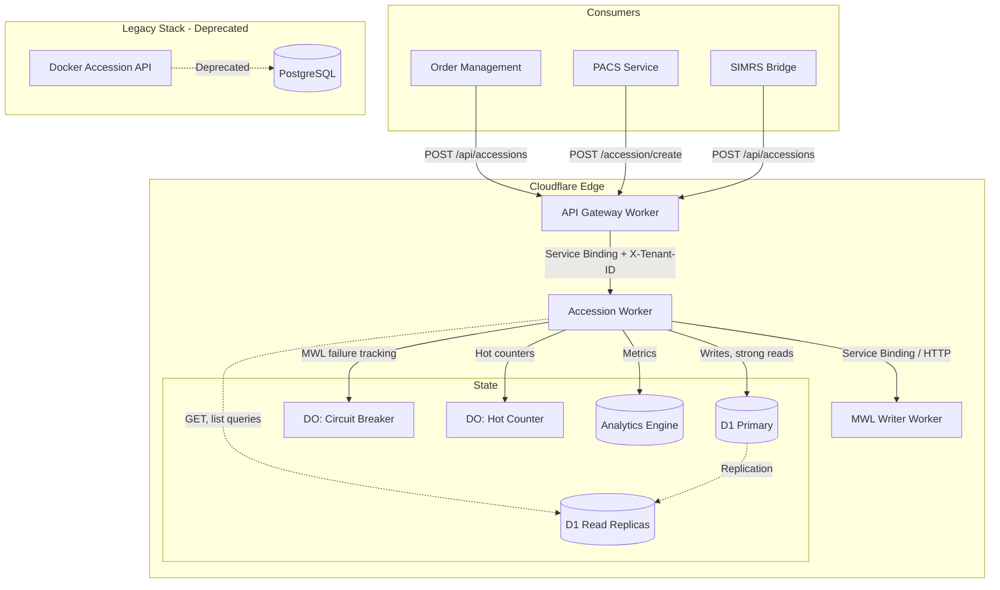
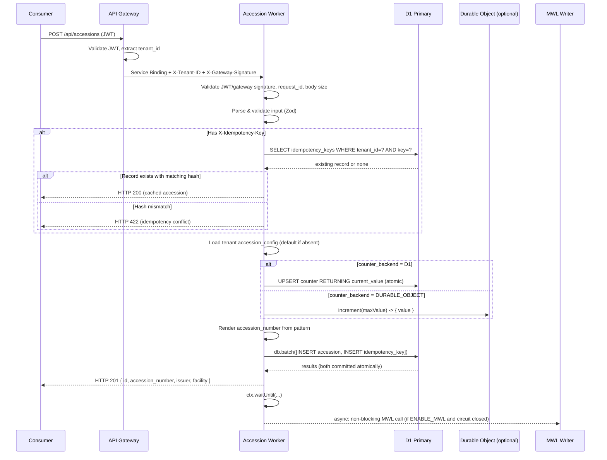
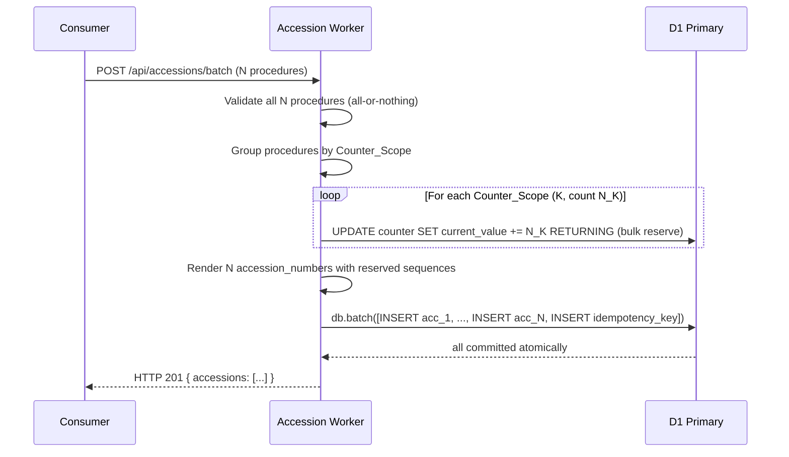
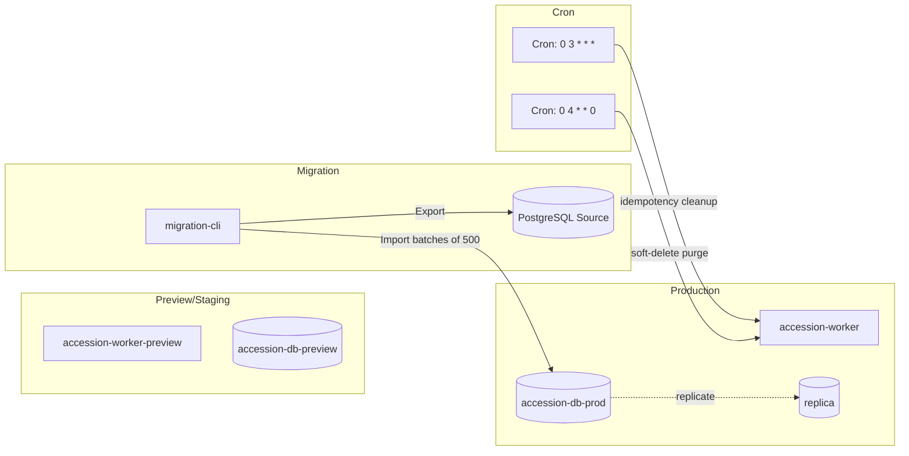
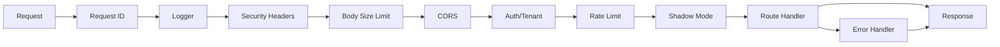

# Design Document: Accession API Migration

## Overview

This design describes the migration of the Accession API from a Docker-based Hono/TypeScript + PostgreSQL service to a Cloudflare Workers + D1 architecture. The new service (`accession-worker`) retains full API contract compatibility with existing consumers (order-management, pacs-service) while gaining edge deployment, eliminating single-point-of-failure Docker dependency, and enabling multi-tenant isolation via D1.

### Key Design Decisions

1. **Hono framework on Workers** — Preserves the existing routing patterns and middleware approach from the Docker service, minimizing code divergence. JWT validation uses `hono/jwt` middleware with HS256 algorithm.
2. **D1 (SQLite) as persistence with read replicas** — Replaces PostgreSQL. Writes go to the primary `DB` binding; reads from GET endpoints use `DB_READ` which routes to the nearest replica. D1 `batch()` is used for atomic multi-statement operations (e.g., counter increment + accession insert).
3. **Single-statement UPSERT for counter increment** — Uses `INSERT ... ON CONFLICT DO UPDATE ... RETURNING` to combine create-or-increment into one D1 roundtrip instead of separate SELECT/UPDATE/INSERT flows. Retry with exponential backoff (10ms → 40ms → 160ms) on contention errors.
4. **Durable Object fallback for hot counters** — Tenants can opt into `counter_backend: DURABLE_OBJECT` when throughput exceeds D1's ~1000 writes/sec limit. The Durable Object handles counter increments with strong consistency; accession records still land in D1.
5. **Dual endpoint support** — Both `/api/accessions` (nested patient format) and `/accession/create` (flat format) are maintained with internal normalization.
6. **Service Binding for MWL with circuit breaker** — Prefers zero-latency Service Binding over HTTP fetch when available; falls back to URL-based fetch. A Durable-Object-backed circuit breaker prevents cascading failures when MWL is down.
7. **Shadow mode with canary rollout** — `SHADOW_MODE=true` globally, or `CANARY_TENANT_IDS` for per-tenant canary, allows the Worker to process write requests without persisting data. GET requests always run normally.
8. **Cron Triggers for maintenance** — Idempotency TTL cleanup runs daily at 03:00 UTC; soft-delete purge runs weekly.
9. **Secrets managed separately from config** — `JWT_SECRET`, `GATEWAY_SHARED_SECRET`, and database credentials are Cloudflare Worker secrets (`wrangler secret put`), never in `[vars]`.
10. **Tenant timezone awareness** — Counter `date_bucket` and date tokens are computed in each tenant's configured timezone (default `Asia/Jakarta`/WIB), not UTC, so that daily resets align with local business hours.
11. **UUID v7 for all primary keys** — Time-ordered UUIDs improve B-tree index locality in SQLite by keeping recent inserts contiguous. Generated via the `uuidv7` package (lightweight, zero-dependency).
12. **Zod for runtime validation** — Chosen over hand-rolled validators for readability and parser-first ergonomics; bundle size impact is acceptable for server-side Workers.
13. **Cloudflare Analytics Engine for metrics** — Business metrics (request counts, latencies, circuit events, job runs) emit to Analytics Engine for free-tier-friendly observability without needing a separate APM.

### Scope

- Cloudflare Worker application with Hono routing (primary + `DB_READ` replica binding)
- D1 database schema and migrations (with audit table and soft-delete support)
- Accession number generation with tenant-timezone-aware configurable format patterns
- Atomic sequence counters via single-statement UPSERT; Durable Object fallback for hot counters
- Idempotency layer with scheduled cleanup via Cron Triggers
- Multi-tenant isolation with rate limiting per tenant
- CRUD operations: create, batch-create, list (keyset-paginated), get, patch, soft-delete
- External accession registration (SIMRS-supplied numbers)
- MWL Writer integration (non-blocking via `ctx.waitUntil()`, with circuit breaker and retry)
- Migration tooling (PostgreSQL → D1)
- Observability: structured JSON logs, Analytics Engine metrics, PII redaction, slow-request tracking
- Health and readiness endpoints with D1 probe

## Architecture

### System Context Diagram



### Request Flow (Single Accession, Happy Path)



### Batch Request Flow



### Deployment Architecture



## Components and Interfaces

### Project Structure

```
cloudflare/accession-worker/
├── src/
│   ├── index.ts                 # Hono app entry point, scheduled() handler, DO exports
│   ├── routes/
│   │   ├── accessions.ts        # POST /api/accessions, GET /api/accessions/:an, PATCH, DELETE, list
│   │   ├── accessions-legacy.ts # POST /accession/create, POST /accession/batch
│   │   ├── batch.ts             # POST /api/accessions/batch
│   │   ├── settings.ts          # GET/PUT /settings/accession_config
│   │   ├── admin.ts             # POST /admin/run-job/:name, POST /admin/revoke-jti
│   │   └── health.ts            # GET /healthz, GET /readyz
│   ├── services/
│   │   ├── accession-generator.ts   # Format pattern rendering, token parsing
│   │   ├── sequence-counter-d1.ts   # D1-backed counter (UPSERT with backoff)
│   │   ├── sequence-counter-do.ts   # Durable-Object-backed counter dispatcher
│   │   ├── idempotency.ts           # Idempotency key management
│   │   ├── mwl-writer.ts            # MWL integration with circuit breaker
│   │   ├── analytics.ts             # Analytics Engine event emission
│   │   └── accession-repository.ts  # D1 CRUD + keyset pagination + audit
│   ├── durable-objects/
│   │   ├── counter-do.ts        # Hot counter Durable Object
│   │   └── circuit-breaker-do.ts# MWL circuit breaker Durable Object
│   ├── middleware/
│   │   ├── auth.ts              # JWT (HS256) + gateway signature trust
│   │   ├── tenant.ts            # Tenant extraction and context injection
│   │   ├── request-id.ts        # X-Request-ID propagation/generation (UUID v7)
│   │   ├── logger.ts            # Structured JSON logging with PII redaction
│   │   ├── shadow-mode.ts       # Shadow mode + canary tenant routing
│   │   ├── cors.ts              # CORS origin allowlist
│   │   ├── rate-limit.ts        # Cloudflare Rate Limiting binding wrapper
│   │   ├── security-headers.ts  # X-Content-Type-Options, HSTS, etc.
│   │   ├── body-size-limit.ts   # Reject > 1 MB bodies
│   │   └── error-handler.ts     # Global error boundary
│   ├── validators/
│   │   ├── accession-input.ts   # Zod schemas for accession create/patch
│   │   ├── batch-input.ts       # Zod schemas for batch request
│   │   ├── format-pattern.ts    # Format pattern validation (with timezone check)
│   │   └── list-query.ts        # Zod schema for list query params + cursor decode
│   ├── models/
│   │   ├── accession.ts         # Accession type definitions (with deleted_at)
│   │   ├── counter.ts           # Counter scope types
│   │   ├── config.ts            # Accession config types (incl. timezone, counter_backend)
│   │   └── audit.ts             # Audit record types
│   ├── utils/
│   │   ├── format-tokens.ts     # Token parsing and rendering
│   │   ├── date-utils.ts        # Timezone-aware date bucket computation
│   │   ├── uuid.ts              # UUID v7 generation (wraps `uuidv7` package)
│   │   ├── cursor.ts            # Keyset pagination cursor encode/decode
│   │   ├── redaction.ts         # PII redaction for logs
│   │   └── backoff.ts           # Exponential backoff helper
│   ├── jobs/
│   │   ├── idempotency-cleanup.ts  # Cron: delete expired idempotency keys
│   │   └── soft-delete-purge.ts    # Cron: physically delete old soft-deletes
│   └── types.ts                 # Shared type definitions, Env bindings
├── migrations/
│   ├── 0001_initial_schema.sql  # Base tables: accessions, counters, idempotency, settings
│   ├── 0002_audit_table.sql     # accession_audit table
│   └── 0003_soft_delete.sql     # Add deleted_at column + update indexes
├── scripts/
│   └── migrate-from-pg.ts       # PostgreSQL → D1 migration tool
├── test/
│   ├── accession-generator.test.ts
│   ├── accession-generator.property.test.ts
│   ├── sequence-counter-d1.test.ts
│   ├── sequence-counter-d1.property.test.ts
│   ├── sequence-counter-do.test.ts
│   ├── idempotency.test.ts
│   ├── validators.test.ts
│   ├── validators.property.test.ts
│   ├── normalization.property.test.ts
│   ├── tenant-isolation.property.test.ts
│   ├── batch.property.test.ts
│   ├── external-accession.property.test.ts
│   ├── observability.property.test.ts
│   ├── redaction.property.test.ts
│   ├── uuid-v7.property.test.ts
│   ├── cursor.property.test.ts
│   ├── circuit-breaker.test.ts
│   └── integration/
│       ├── api.test.ts
│       ├── batch.test.ts
│       ├── shadow-mode.test.ts
│       └── scheduled-jobs.test.ts
├── wrangler.jsonc
├── tsconfig.json
├── package.json
└── vitest.config.ts
```

### Key Interfaces

#### Environment Bindings (types.ts)

```typescript
interface Env {
  // D1 Database bindings
  DB: D1Database;                    // Primary (writes + strong reads)
  DB_READ?: D1Database;              // Read replica (GET endpoints, best-effort)
  
  // Durable Object bindings
  COUNTER_DO?: DurableObjectNamespace;          // Hot counter fallback
  CIRCUIT_BREAKER_DO: DurableObjectNamespace;   // MWL circuit breaker
  
  // Service Bindings
  MWL_WRITER?: Fetcher;
  
  // Analytics Engine
  METRICS: AnalyticsEngineDataset;              // dataset: accession_metrics
  RATE_LIMIT_EVENTS: AnalyticsEngineDataset;
  CIRCUIT_EVENTS: AnalyticsEngineDataset;
  JOB_RUNS: AnalyticsEngineDataset;
  
  // Rate Limiting (Cloudflare Rate Limiting bindings)
  RATE_LIMITER_WRITE: RateLimit;                // 100/10s per tenant
  RATE_LIMITER_READ: RateLimit;                 // 500/10s per tenant
  
  // Secrets (wrangler secret put)
  JWT_SECRET: string;                           // Required, HS256
  GATEWAY_SHARED_SECRET?: string;               // For X-Gateway-Signature HMAC
  
  // Environment variables (wrangler.jsonc vars)
  ENABLE_MWL: string;           // "true" | "false"
  MWL_WRITER_URL?: string;
  FACILITY_CODE: string;
  SHADOW_MODE?: string;         // "true" | "false"
  CANARY_TENANT_IDS?: string;   // comma-separated
  MIGRATION_AUDIT_LOG?: string; // "true" | "false"
  ALLOWED_ORIGINS?: string;     // comma-separated origins
  LOG_SAMPLE_RATE?: string;     // "0.0" to "1.0"
  BUILD_VERSION?: string;       // Git SHA injected at deploy
}

interface TenantContext {
  tenantId: string;
  facilityCode: string;
  timezone: string;              // IANA, default "Asia/Jakarta"
  source: 'jwt' | 'gateway';     // How tenant was authenticated
  jwtClaims?: JWTClaims;
  roles: string[];               // e.g., ["admin", "data_steward"]
}

interface JWTClaims {
  tenant_id: string;
  jti: string;
  sub: string;
  exp: number;
  nbf?: number;
  roles?: string[];
}
```

#### Accession Generator Interface

```typescript
interface AccessionConfig {
  pattern: string;                    // e.g., "{ORG}-{YYYY}{MM}{DD}-{NNNN}"
  counter_reset_policy: 'DAILY' | 'MONTHLY' | 'NEVER';
  sequence_digits: number;            // padding length (1-8)
  timezone: string;                   // IANA, default "Asia/Jakarta"
  counter_backend: 'D1' | 'DURABLE_OBJECT';  // default 'D1'
  orgCode?: string;
  siteCode?: string;
  useModalityInSeqScope?: boolean;
}

interface GenerateAccessionInput {
  modality: string;
  facilityCode: string;
  tenantId: string;
  config: AccessionConfig;
  sequenceNumber: number;
  date?: Date;                        // defaults to new Date()
}

function renderAccessionNumber(input: GenerateAccessionInput): string;
function tokenize(pattern: string): Token[];
function validateFormatPattern(pattern: string, sequenceDigits: number): ValidationResult;
function computeDateBucket(policy: string, date: Date, timezone: string): string;
function computeCounterScope(
  tenantId: string,
  facilityCode: string,
  modality: string,
  dateBucket: string,
  useModalityInSeqScope: boolean
): CounterScope;
function computeDatePartsInTimezone(date: Date, timezone: string): DateParts;
```

#### Sequence Counter Interface

```typescript
interface CounterScope {
  tenantId: string;
  facilityCode: string;
  modality: string;    // empty string if useModalityInSeqScope is false
  dateBucket: string;  // "YYYYMMDD" | "YYYYMM" | "ALL"
}

interface IncrementResult {
  value: number;
  isNew: boolean;
}

// D1 implementation: single UPSERT with exponential backoff on contention
// Reserves N sequence numbers atomically (used by batch endpoint)
async function incrementCounterD1(
  db: D1Database,
  scope: CounterScope,
  maxValue: number,
  count?: number           // default 1; reserves consecutive N values for batch
): Promise<{ startValue: number; endValue: number }>;

// Durable Object implementation: routes to DO instance by scope hash
async function incrementCounterDO(
  env: Env,
  scope: CounterScope,
  maxValue: number,
  count?: number
): Promise<{ startValue: number; endValue: number }>;

// Dispatcher that picks D1 or DO based on config.counter_backend
async function incrementCounter(
  env: Env,
  config: AccessionConfig,
  scope: CounterScope,
  count?: number
): Promise<{ startValue: number; endValue: number }>;
```

#### Idempotency Interface

```typescript
interface IdempotencyRecord {
  key: string;
  tenantId: string;
  accessionId: string;            // or batch_id for batch operations
  requestHash: string;            // SHA-256(modality + patient_national_id)
  payloadType: 'single' | 'batch';
  payload: string;                // JSON of result to return on replay
  createdAt: string;
  expiresAt: string;              // 24h after createdAt
}

async function checkIdempotency(
  db: D1Database,
  tenantId: string,
  key: string,
  requestHash: string
): Promise<{ exists: boolean; record?: IdempotencyRecord; conflict?: boolean }>;

async function storeIdempotency(
  db: D1Database,
  record: IdempotencyRecord
): Promise<void>;

// Invoked by Cron Trigger at 03:00 UTC daily
async function idempotencyCleanupJob(
  env: Env
): Promise<{ deleted: number; elapsedMs: number }>;
```

#### Circuit Breaker Interface (Durable Object)

```typescript
// Circuit states: closed (normal), open (failing), half-open (probing)
type CircuitState = 'closed' | 'open' | 'half-open';

interface CircuitStatus {
  state: CircuitState;
  consecutiveFailures: number;
  openedAt?: number;              // epoch ms
  openUntil?: number;              // epoch ms
}

// Durable Object methods (RPC)
class CircuitBreakerDO {
  async getStatus(): Promise<CircuitStatus>;
  async recordSuccess(): Promise<void>;
  async recordFailure(): Promise<CircuitStatus>;  // may transition to open
  async tryAcquire(): Promise<{ allowed: boolean; status: CircuitStatus }>;
}
```

#### Input Normalization

```typescript
// Unified internal representation after normalization
interface NormalizedAccessionInput {
  patientNationalId: string;      // NIK - 16 digits
  patientName: string;
  patientIhsNumber?: string;      // P + 11 digits
  patientBirthDate?: string;      // YYYY-MM-DD
  patientSex?: 'male' | 'female' | 'other' | 'unknown';
  medicalRecordNumber?: string;
  modality: Modality;             // CT | MR | CR | DX | US | XA | RF | MG | NM | PT
  procedureCode?: string;
  procedureName?: string;
  facilityCode?: string;
  scheduledAt?: string;           // ISO 8601
  note?: string;
  accessionNumber?: string;       // Pre-supplied external accession number
  idempotencyKey?: string;
}

type Modality = 'CT' | 'MR' | 'CR' | 'DX' | 'US' | 'XA' | 'RF' | 'MG' | 'NM' | 'PT';

// Zod schemas for validation
const nestedFormatSchema: z.ZodSchema<NestedInput>;
const flatFormatSchema: z.ZodSchema<FlatInput>;
const batchSchema: z.ZodSchema<BatchInput>;

function normalizeNestedFormat(input: z.infer<typeof nestedFormatSchema>): NormalizedAccessionInput;
function normalizeFlatFormat(input: z.infer<typeof flatFormatSchema>): NormalizedAccessionInput;
```

#### Keyset Pagination

```typescript
// Opaque cursor encodes (created_at, id) for stable pagination
interface DecodedCursor {
  createdAt: string;        // ISO 8601
  id: string;               // UUID v7
}

function encodeCursor(cursor: DecodedCursor): string;       // base64url of JSON
function decodeCursor(encoded: string): DecodedCursor | null; // returns null if invalid
```

### Middleware Chain



1. **Request ID** — Extracts valid UUID `X-Request-ID` or generates a new UUID v7
2. **Logger** — Attaches structured logging context with PII redaction hooks
3. **Security Headers** — Adds `X-Content-Type-Options`, `X-Frame-Options`, HSTS, Referrer-Policy
4. **Body Size Limit** — Rejects bodies > 1 MB with HTTP 413
5. **CORS** — Handles preflight and validates origin against `ALLOWED_ORIGINS`
6. **Auth/Tenant** — Service Binding identity > `X-Gateway-Signature` HMAC > JWT HS256; extracts tenant_id
7. **Rate Limit** — Per-tenant rate limiting (100/10s writes, 500/10s reads); returns 429 with `Retry-After`
8. **Shadow Mode** — If `SHADOW_MODE=true` or tenant in `CANARY_TENANT_IDS` shadow cohort, writes are intercepted; GET requests pass through
9. **Route Handler** — Business logic
10. **Error Handler** — Global error boundary that logs full stack trace internally but returns sanitized 500 response

## Data Models

### D1 Schema

```sql
-- migrations/0001_initial_schema.sql

-- Accession records
CREATE TABLE IF NOT EXISTS accessions (
    id TEXT PRIMARY KEY,                          -- UUID v7 (time-ordered for index locality)
    tenant_id TEXT NOT NULL,
    accession_number TEXT NOT NULL,
    issuer TEXT,
    facility_code TEXT,
    modality TEXT NOT NULL,
    patient_national_id TEXT NOT NULL,
    patient_name TEXT NOT NULL,
    patient_ihs_number TEXT,
    patient_birth_date TEXT,
    patient_sex TEXT,
    medical_record_number TEXT,
    procedure_code TEXT,
    procedure_name TEXT,
    scheduled_at TEXT,
    note TEXT,
    source TEXT NOT NULL DEFAULT 'internal',       -- 'internal' | 'external'
    created_at TEXT NOT NULL,                      -- ISO 8601
    deleted_at TEXT                                -- Soft delete timestamp (NULL = active)
);

-- Unique constraint: no duplicate accession numbers per tenant
CREATE UNIQUE INDEX IF NOT EXISTS idx_accessions_tenant_number 
    ON accessions(tenant_id, accession_number);

-- Keyset pagination index (DESC ordering for newest-first lookup)
CREATE INDEX IF NOT EXISTS idx_accessions_tenant_created 
    ON accessions(tenant_id, created_at DESC, id DESC);

-- Patient lookup index
CREATE INDEX IF NOT EXISTS idx_accessions_tenant_patient
    ON accessions(tenant_id, patient_national_id);

-- Source filtering index
CREATE INDEX IF NOT EXISTS idx_accessions_tenant_source
    ON accessions(tenant_id, source, created_at DESC);

-- Soft-delete partial filter (supported by SQLite 3.8.0+)
CREATE INDEX IF NOT EXISTS idx_accessions_tenant_active
    ON accessions(tenant_id, created_at DESC) WHERE deleted_at IS NULL;

-- Sequence counters (composite PK eliminates surrogate id overhead)
CREATE TABLE IF NOT EXISTS accession_counters (
    tenant_id TEXT NOT NULL,
    facility_code TEXT NOT NULL,
    modality TEXT NOT NULL DEFAULT '',
    date_bucket TEXT NOT NULL,                    -- 'YYYYMMDD' | 'YYYYMM' | 'ALL'
    current_value INTEGER NOT NULL DEFAULT 0,
    updated_at TEXT NOT NULL,
    PRIMARY KEY (tenant_id, facility_code, modality, date_bucket)
);

-- Idempotency keys with TTL
CREATE TABLE IF NOT EXISTS idempotency_keys (
    tenant_id TEXT NOT NULL,
    key TEXT NOT NULL,
    accession_id TEXT NOT NULL,                   -- or batch_id for batch ops
    request_hash TEXT NOT NULL,                   -- SHA-256(modality + patient_national_id)
    payload_type TEXT NOT NULL DEFAULT 'single', -- 'single' | 'batch'
    payload TEXT NOT NULL,                        -- JSON of result to return on replay
    created_at TEXT NOT NULL,
    expires_at TEXT NOT NULL,                     -- ISO 8601, 24h after creation
    PRIMARY KEY (tenant_id, key)
);

-- Index for TTL cleanup (used by cron job)
CREATE INDEX IF NOT EXISTS idx_idempotency_expires 
    ON idempotency_keys(expires_at);

-- Tenant settings (accession config, counter_backend, etc.)
CREATE TABLE IF NOT EXISTS tenant_settings (
    tenant_id TEXT NOT NULL,
    key TEXT NOT NULL,
    value TEXT NOT NULL,                          -- JSON-encoded
    updated_at TEXT NOT NULL,
    PRIMARY KEY (tenant_id, key)
);

-- Audit log for UPDATE/DELETE operations (migration 0002)
CREATE TABLE IF NOT EXISTS accession_audit (
    id TEXT PRIMARY KEY,                          -- UUID v7
    accession_id TEXT NOT NULL,
    tenant_id TEXT NOT NULL,
    actor TEXT NOT NULL,                          -- user_id or service name from JWT
    action TEXT NOT NULL CHECK (action IN ('UPDATE', 'DELETE')),
    changes TEXT NOT NULL,                        -- JSON diff
    created_at TEXT NOT NULL
);

CREATE INDEX IF NOT EXISTS idx_audit_accession 
    ON accession_audit(accession_id, created_at DESC);
CREATE INDEX IF NOT EXISTS idx_audit_tenant_created
    ON accession_audit(tenant_id, created_at DESC);
```

### Atomic Counter Increment Algorithm (D1)

Single-statement UPSERT combines create-or-increment into one roundtrip:

```typescript
async function incrementCounterD1(
  db: D1Database,
  scope: CounterScope,
  maxValue: number,
  count: number = 1
): Promise<{ startValue: number; endValue: number }> {
  const backoff = [10, 40, 160]; // ms
  const now = new Date().toISOString();

  for (let attempt = 0; attempt <= backoff.length; attempt++) {
    try {
      // Single-statement atomic upsert: creates row at `count` or increments by `count`
      const row = await db.prepare(`
        INSERT INTO accession_counters
          (tenant_id, facility_code, modality, date_bucket, current_value, updated_at)
        VALUES (?, ?, ?, ?, ?, ?)
        ON CONFLICT(tenant_id, facility_code, modality, date_bucket) DO UPDATE
          SET current_value = current_value + ?,
              updated_at = excluded.updated_at
          WHERE current_value + ? <= ?
        RETURNING current_value
      `).bind(
        scope.tenantId, scope.facilityCode, scope.modality, scope.dateBucket,
        count, now,
        count, count, maxValue
      ).first<{ current_value: number }>();

      if (row) {
        return { startValue: row.current_value - count + 1, endValue: row.current_value };
      }

      // UPDATE was blocked by WHERE clause → sequence exhausted
      throw new SequenceExhaustedError(scope, maxValue);
    } catch (e: any) {
      if (isContentionError(e) && attempt < backoff.length) {
        await sleep(backoff[attempt]);
        continue;
      }
      throw e;
    }
  }
  throw new WriteContentionError(scope, backoff.length + 1);
}

function isContentionError(e: any): boolean {
  const msg = String(e?.message ?? '').toLowerCase();
  return msg.includes('busy') || msg.includes('locked') || msg.includes('contention');
}
```

### Durable Object Counter (Hot Scopes)

```typescript
// durable-objects/counter-do.ts
export class CounterDurableObject {
  private state: DurableObjectState;
  private current: number = 0;
  private loaded: boolean = false;

  constructor(state: DurableObjectState) {
    this.state = state;
  }

  async increment(request: Request): Promise<Response> {
    const { maxValue, count = 1 } = await request.json<{ maxValue: number; count?: number }>();

    if (!this.loaded) {
      this.current = (await this.state.storage.get<number>('current_value')) ?? 0;
      this.loaded = true;
    }

    if (this.current + count > maxValue) {
      return new Response(JSON.stringify({ error: 'sequence_exhausted' }), { status: 409 });
    }

    const startValue = this.current + 1;
    this.current += count;
    await this.state.storage.put('current_value', this.current);

    return new Response(JSON.stringify({ startValue, endValue: this.current }), { status: 200 });
  }

  async fetch(request: Request): Promise<Response> {
    const url = new URL(request.url);
    if (url.pathname === '/increment') return this.increment(request);
    return new Response('Not Found', { status: 404 });
  }
}

// Dispatch by SHA-256 hash of counter scope for consistent routing
async function getCounterDO(env: Env, scope: CounterScope): Promise<DurableObjectStub> {
  const scopeKey = `${scope.tenantId}|${scope.facilityCode}|${scope.modality}|${scope.dateBucket}`;
  const hash = await sha256Hex(scopeKey);
  const id = env.COUNTER_DO!.idFromName(hash);
  return env.COUNTER_DO!.get(id);
}
```

### Accession Number Format Rendering (Timezone-Aware)

```typescript
function renderAccessionNumber(input: GenerateAccessionInput): string {
  const { config, modality, sequenceNumber, date = new Date() } = input;
  const tokens = tokenize(config.pattern);
  const dp = computeDatePartsInTimezone(date, config.timezone);
  
  let result = '';
  for (const token of tokens) {
    if (!token.isToken) {
      result += token.text;
      continue;
    }
    switch (token.normalized) {
      case 'YYYY': result += dp.YYYY; break;
      case 'YY':   result += dp.YY; break;
      case 'MM':   result += dp.MM; break;
      case 'DD':   result += dp.DD; break;
      case 'DOY':  result += dp.DOY; break;
      case 'HOUR': result += dp.HOUR; break;
      case 'MIN':  result += dp.MIN; break;
      case 'SEC':  result += dp.SEC; break;
      case 'MOD':  result += modality; break;
      case 'ORG':  result += config.orgCode ?? ''; break;
      case 'SITE': result += config.siteCode ?? ''; break;
      default:
        if (token.isSequence) {
          result += String(sequenceNumber).padStart(token.digits, '0');
        } else if (token.isRandom) {
          result += randomDigits(token.digits);
        }
    }
  }
  return result;
}

// Compute date parts using Intl.DateTimeFormat for timezone-aware rendering
function computeDatePartsInTimezone(date: Date, timezone: string): DateParts {
  const fmt = new Intl.DateTimeFormat('en-GB', {
    timeZone: timezone,
    year: 'numeric', month: '2-digit', day: '2-digit',
    hour: '2-digit', minute: '2-digit', second: '2-digit',
    hour12: false,
  });
  const parts = Object.fromEntries(fmt.formatToParts(date).map(p => [p.type, p.value]));
  const YYYY = parts.year;
  const MM = parts.month;
  const DD = parts.day;
  // Day-of-year requires manual calc
  const yearStart = new Date(Date.UTC(Number(YYYY), 0, 1));
  const doy = Math.floor((date.getTime() - yearStart.getTime()) / 86400000) + 1;
  return {
    YYYY, YY: YYYY.slice(2), MM, DD,
    DOY: String(doy).padStart(3, '0'),
    HOUR: parts.hour, MIN: parts.minute, SEC: parts.second,
  };
}

function computeDateBucket(
  policy: 'DAILY' | 'MONTHLY' | 'NEVER',
  date: Date,
  timezone: string
): string {
  if (policy === 'NEVER') return 'ALL';
  const dp = computeDatePartsInTimezone(date, timezone);
  if (policy === 'DAILY') return `${dp.YYYY}${dp.MM}${dp.DD}`;
  return `${dp.YYYY}${dp.MM}`; // MONTHLY
}
```

### wrangler.jsonc Configuration

```jsonc
{
  "name": "accession-worker",
  "main": "src/index.ts",
  "compatibility_date": "2025-01-01",
  "compatibility_flags": ["nodejs_compat"],

  "vars": {
    "ENABLE_MWL": "false",
    "FACILITY_CODE": "RS01",
    "SHADOW_MODE": "false",
    "MIGRATION_AUDIT_LOG": "false",
    "LOG_SAMPLE_RATE": "1.0"
  },

  "d1_databases": [
    {
      "binding": "DB",
      "database_name": "accession-db-prod",
      "database_id": "<production-db-id>",
      "migrations_dir": "migrations"
    },
    {
      "binding": "DB_READ",
      "database_name": "accession-db-prod",
      "database_id": "<production-db-id>",
      "experimental_remote": true
    }
  ],

  "durable_objects": {
    "bindings": [
      { "name": "COUNTER_DO",         "class_name": "CounterDurableObject" },
      { "name": "CIRCUIT_BREAKER_DO", "class_name": "CircuitBreakerDurableObject" }
    ]
  },

  "migrations": [
    { "tag": "v1", "new_classes": ["CounterDurableObject", "CircuitBreakerDurableObject"] }
  ],

  "analytics_engine_datasets": [
    { "binding": "METRICS",            "dataset": "accession_metrics" },
    { "binding": "RATE_LIMIT_EVENTS",  "dataset": "rate_limit_events" },
    { "binding": "CIRCUIT_EVENTS",     "dataset": "circuit_events" },
    { "binding": "JOB_RUNS",           "dataset": "job_runs" }
  ],

  "unsafe": {
    "bindings": [
      { "name": "RATE_LIMITER_WRITE", "type": "ratelimit", "namespace_id": "1001",
        "simple": { "limit": 100, "period": 10 } },
      { "name": "RATE_LIMITER_READ",  "type": "ratelimit", "namespace_id": "1002",
        "simple": { "limit": 500, "period": 10 } }
    ]
  },

  "triggers": {
    "crons": ["0 3 * * *", "0 4 * * 0"]
  },

  "observability": {
    "enabled": true,
    "logs": { "enabled": true, "invocation_logs": true, "head_sampling_rate": 1 }
  },

  "env": {
    "preview": {
      "name": "accession-worker-preview",
      "d1_databases": [
        {
          "binding": "DB",
          "database_name": "accession-db-preview",
          "database_id": "<preview-db-id>",
          "migrations_dir": "migrations"
        }
      ]
    }
  }
}
```

Secrets (set via `wrangler secret put` — NOT in `vars`):
- `JWT_SECRET` — HS256 signing key
- `GATEWAY_SHARED_SECRET` — HMAC key for `X-Gateway-Signature` verification
- `POSTGRES_MIGRATION_URL` — only for migration scripts, not runtime

## Correctness Properties

*A property is a characteristic or behavior that should hold true across all valid executions of a system — essentially, a formal statement about what the system should do. Properties serve as the bridge between human-readable specifications and machine-verifiable correctness guarantees.*

### Property 1: Accession number format rendering matches pattern structure

*For any* valid AccessionConfig pattern and valid input (modality, facilityCode, date, sequenceNumber), the rendered accession number SHALL have each token replaced with a value of the correct format: `{YYYY}` → 4-digit year, `{MM}` → 2-digit month, `{DD}` → 2-digit day, `{DOY}` → 3-digit day-of-year, `{MOD}` → modality string, `{ORG}` → org code, `{NNN...}` → zero-padded sequence of correct length, `{SEQn}` → same as `{N×n}`, and literal separators preserved in position.

**Validates: Requirements 1.1, 2.2**

### Property 2: Date bucket computation is timezone-aware and correct for all reset policies

*For any* date and counter_reset_policy and valid IANA timezone, `computeDateBucket` SHALL return: the date formatted as `YYYYMMDD` in the provided timezone when policy is `DAILY`, formatted as `YYYYMM` in the provided timezone when policy is `MONTHLY`, and the literal string `ALL` when policy is `NEVER`. *In particular*, two UTC timestamps falling on the same local day in the tenant timezone SHALL produce the same date_bucket.

**Validates: Requirements 2.3, 2.4, 2.5, 2.14**

### Property 3: Counter scope correctly includes or excludes modality

*For any* tenant_id, facility_code, modality, date_bucket, and useModalityInSeqScope flag, `computeCounterScope` SHALL include the modality in the scope key when `useModalityInSeqScope` is true, and SHALL use an empty string for modality when it is false — ensuring that different modalities share a counter when the flag is disabled and have independent counters when enabled.

**Validates: Requirements 2.12, 3.3, 5.4**

### Property 4: Sequential counter increments produce monotonically increasing values without gaps

*For any* counter scope, a sequence of N successful `incrementCounter` calls (single-count mode) SHALL return values 1, 2, 3, ..., N with no duplicates and no gaps, and the first call on a new scope SHALL always return 1. This property holds for both D1 and Durable Object backends.

**Validates: Requirements 1.5, 3.1, 3.4, 3.6, 3A.3**

### Property 4A: Batch counter reservation produces consecutive value ranges

*For any* counter scope and batch count K ≥ 1, a successful `incrementCounter(scope, count=K)` SHALL return `{ startValue: S, endValue: S+K-1 }` where S is the previous `current_value + 1` or 1 if the row was newly created, and the next call SHALL return values starting from `S+K`.

**Validates: Requirements 3.1, 16.4, 16.8**

### Property 5: Issuer field follows SATUSEHAT format

*For any* valid patient_national_id (16-digit string) and accession_number (non-empty string ≤ 64 chars), the generated issuer SHALL equal `http://sys-ids.kemkes.go.id/acsn/{patient_national_id}|{accession_number}` exactly.

**Validates: Requirements 1.4, 17.4**

### Property 6: Input validation correctly classifies valid and invalid NIK values

*For any* string, the NIK validator SHALL accept it if and only if it consists of exactly 16 numeric characters (`/^\d{16}$/`). All other strings (wrong length, non-numeric, empty, whitespace) SHALL be rejected.

**Validates: Requirements 6.1**

### Property 7: Input validation correctly classifies modality values

*For any* string, the modality validator SHALL accept it if and only if it is one of the 10 allowed values: CT, MR, CR, DX, US, XA, RF, MG, NM, PT. All other strings SHALL be rejected.

**Validates: Requirements 6.2**

### Property 8: Validation aggregates all errors in a single response

*For any* input containing N distinct validation failures (N ≥ 1), the validation function SHALL return exactly N error objects, each identifying the failing field and a descriptive message.

**Validates: Requirements 6.6**

### Property 9: Format normalization equivalence between nested and flat formats

*For any* valid patient/procedure data, normalizing from the nested format (`patient.id`, `patient.name`, `patient.ihs_number`, `patient.sex`) and from the flat format (`patient_national_id`, `patient_name`, `ihs_number`, `gender`) SHALL produce identical `NormalizedAccessionInput` records.

**Validates: Requirements 10.3, 10.7**

### Property 10: Idempotency key lookup returns cached result or detects conflict

*For any* previously stored idempotency record with key K, tenant T, and request hash H: a subsequent request with the same (K, T, H) SHALL return the cached accession, while a request with the same (K, T) but different H SHALL be flagged as a conflict.

**Validates: Requirements 4.1, 4.2, 4.3**

### Property 11: Idempotency key TTL is exactly 24 hours after creation

*For any* idempotency record created at time C, the `expires_at` field SHALL equal C + 24 hours (86400 seconds) in ISO 8601 format.

**Validates: Requirements 4.4**

### Property 11A: Scheduled idempotency cleanup removes only expired records

*For any* set of idempotency records, a scheduled cleanup run at time T SHALL delete exactly those records where `expires_at < T` and SHALL NOT delete any record where `expires_at >= T`. The post-cleanup count SHALL equal the count of records with `expires_at >= T`.

**Validates: Requirements 4.8, 4.9**

### Property 12: Tenant isolation prevents cross-tenant access

*For any* accession record belonging to tenant A, a lookup request authenticated as tenant B (where A ≠ B) SHALL return HTTP 404 without revealing the record's existence.

**Validates: Requirements 5.3**

### Property 13: Batch generation produces exactly N accessions for N valid procedures

*For any* batch request containing N valid procedure items (1 ≤ N ≤ 20), the service SHALL return exactly N accession records, each with a unique accession_number, and the sequence numbers within the same counter scope SHALL be consecutive.

**Validates: Requirements 16.3, 16.8**

### Property 14: Batch validation is all-or-nothing

*For any* batch request where at least one procedure item fails validation, the service SHALL return an error response identifying the failing indices and SHALL NOT persist any accession records.

**Validates: Requirements 16.5**

### Property 15: External accession registration preserves the supplied number and does not increment counter

*For any* request containing a non-empty `accession_number` field, the stored record SHALL have `source = 'external'` and `accession_number` equal to the supplied value exactly, and the sequence counter for the relevant scope SHALL remain unchanged.

**Validates: Requirements 17.2, 17.6**

### Property 16: Source field is correctly assigned based on accession origin

*For any* accession creation request, the `source` field SHALL be `'external'` when the request body contains a non-empty `accession_number` field, and `'internal'` when it does not.

**Validates: Requirements 17.2, 17.3**

### Property 17: External accession number validation

*For any* externally-supplied accession number string, the validator SHALL accept it if and only if it is non-empty, does not exceed 64 characters, and contains only printable ASCII characters (codes 32-126, excluding strings that are whitespace-only).

**Validates: Requirements 17.7**

### Property 18: Format pattern validation rejects patterns without sequence token or exceeding max length

*For any* format pattern string, the pattern validator SHALL reject it if it does not contain at least one sequence token (`{N+}` or `{SEQn}` pattern), and SHALL reject it if the maximum possible rendered output exceeds 64 characters.

**Validates: Requirements 2.7, 2.8**

### Property 19: Log level classification matches HTTP status code ranges

*For any* HTTP response status code, the log level SHALL be `'info'` for codes 200-399 and 429, `'warn'` for codes 400-499 (except 429), and `'error'` for codes 500-599.

**Validates: Requirements 15.6**

### Property 20: Error responses do not leak internal details

*For any* unexpected server error (HTTP 500), the response body SHALL contain only `request_id` and a generic `error` message, and SHALL NOT contain stack traces, file paths, variable names, or internal state.

**Validates: Requirements 15.2**

### Property 21: UUID v7 values sort in chronological generation order

*For any* sequence of UUID v7 values generated at monotonically increasing timestamps, lexicographic (string) comparison SHALL produce the same order as timestamp-based comparison: `uuid1 < uuid2` ⟺ `ts1 < ts2` (where ts1 < ts2 by at least 1 ms).

**Validates: Requirements 1.3, 8.7, 15.5**

### Property 22: PII redaction preserves structure but removes sensitive values

*For any* input object containing fields named `patient_national_id`, `patient_ihs_number`, `password`, `token`, or `secret` (at any nesting depth), the redacted output SHALL preserve the same object structure and all non-sensitive field values, SHALL reduce `patient_national_id` to the pattern `****XXXX` (last 4 digits), SHALL reduce `patient_ihs_number` to `P***********`, and SHALL replace `password`/`token`/`secret` with the literal string `[REDACTED]`.

**Validates: Requirements 15.7**

### Property 23: Healthz reports degraded state when D1 is unavailable

*For any* state in which the D1 probe (`SELECT 1`) fails or times out, the `/healthz` endpoint SHALL return HTTP 200 with top-level `status: "degraded"` and `checks.db.status: "error"`. When D1 is healthy, the response SHALL have `status: "ok"` and `checks.db.status: "ok"`.

**Validates: Requirements 11.7, 11.8**

### Property 24: CORS Allow-Origin header is set only for allowed origins

*For any* request with an `Origin` header O: IF O is in the `ALLOWED_ORIGINS` comma-separated list, THEN the response SHALL include `Access-Control-Allow-Origin: O`. IF O is NOT in the list (or `ALLOWED_ORIGINS` is unset), THEN the response SHALL omit the `Access-Control-Allow-Origin` header entirely.

**Validates: Requirements 12.4**

### Property 25: Request ID is propagated when valid, generated when absent or malformed

*For any* request, IF the `X-Request-ID` header is present and matches the UUID v4 or v7 format, THEN the response `X-Request-ID` header SHALL equal the request header value. OTHERWISE the response `X-Request-ID` header SHALL be a valid UUID v7 generated by the Worker.

**Validates: Requirements 15.4, 15.5**

### Property 26: Shadow mode does not mutate state

*For any* write request (POST/PATCH/DELETE) processed while `SHADOW_MODE=true` OR while the request's tenant_id is NOT in the canary cohort, the D1 state (accessions, accession_counters, idempotency_keys, accession_audit) SHALL be identical before and after the request. The response SHALL be HTTP 202 with body `{ status: "shadow", would_respond: {...} }`.

**Validates: Requirements 13.2, 13.3, 13.6**

### Property 27: Keyset pagination cursor round-trip is stable

*For any* cursor value C produced by `encodeCursor({createdAt, id})`, `decodeCursor(C)` SHALL return an object equal to the original input. *For any* malformed cursor string M (non-base64url, not JSON, missing fields), `decodeCursor(M)` SHALL return `null` rather than throwing.

**Validates: Requirements 7.6, 7.8**

### Property 28: List endpoint pagination produces non-overlapping pages in correct order

*For any* sequence of accession records for a tenant ordered by (created_at DESC, id DESC), iterating the list endpoint using returned cursors SHALL yield each record exactly once across all pages, with pages ordered from newest to oldest, and the final page SHALL have `next_cursor: null`.

**Validates: Requirements 7.4, 7.5, 7.6**

### Property 29: Immutable fields cannot be modified via PATCH

*For any* PATCH request body containing any of the immutable fields (`id`, `tenant_id`, `accession_number`, `issuer`, `patient_national_id`, `facility_code`, `modality`, `source`, `created_at`), the response SHALL be HTTP 400 with an error message listing which immutable fields were attempted, and the underlying record SHALL NOT be modified.

**Validates: Requirements 7A.3**

### Property 30: Soft-deleted records are excluded from default list/get results

*For any* accession record with `deleted_at IS NOT NULL`, the GET endpoints `/api/accessions/:n` and `/api/accessions` SHALL return HTTP 404 (for single-get) or exclude the record (for list) when `include_deleted` is not set to `true`. When `include_deleted=true`, the record SHALL be returned.

**Validates: Requirements 7A.5, 7A.7**

### Property 31: Circuit breaker transitions follow closed → open → half-open → closed pattern

*For any* circuit breaker with closed initial state: after 5 consecutive failures within 60s, `tryAcquire()` SHALL return `{allowed: false, state: 'open'}`. After 30s from open time, the next `tryAcquire()` SHALL return `{allowed: true, state: 'half-open'}`. IF the probe succeeds and `recordSuccess()` is called, the next `tryAcquire()` SHALL return `{allowed: true, state: 'closed'}` with `consecutiveFailures: 0`.

**Validates: Requirements 9.6, 9.7, 9.8**

### Property 32: Rate limit enforcement returns 429 with Retry-After

*For any* tenant that has exceeded the configured request rate (e.g., 100 POST /api/accessions in 10 seconds), subsequent requests within the window SHALL receive HTTP 429 with a `Retry-After` header whose value is a positive integer representing seconds until the window resets.

**Validates: Requirements 12.7, 12.8**

## Error Handling

### Error Response Format

All error responses follow a consistent JSON structure:

```typescript
// Single validation error
interface ErrorResponse {
  error: string;        // Human-readable error message
  request_id: string;   // Correlation ID
}

// Multiple validation errors (HTTP 400)
interface ValidationErrorResponse {
  errors: Array<{
    field: string;      // Field path (e.g., "patient.id", "modality")
    message: string;    // Descriptive error message
  }>;
  request_id: string;
}

// Batch validation errors (HTTP 400)
interface BatchValidationErrorResponse {
  errors: Array<{
    index: number;      // Procedure index in the batch
    field: string;
    message: string;
  }>;
  request_id: string;
}
```

### Error Categories and HTTP Status Codes

| Status | Condition | Response |
|--------|-----------|----------|
| 400 | Invalid input (validation failures) | `ValidationErrorResponse` with all errors |
| 400 | Idempotency key empty or > 128 chars | `ErrorResponse` |
| 400 | Batch size < 1 or > 20 | `ErrorResponse` |
| 400 | Invalid format pattern or timezone | `ErrorResponse` |
| 400 | PATCH request attempting to modify immutable fields | `ErrorResponse` with field list |
| 400 | DELETE without `?confirm=true` | `ErrorResponse` |
| 400 | Invalid keyset pagination cursor | `ErrorResponse` |
| 401 | Missing/invalid/expired JWT, wrong algorithm, or revoked jti | `ErrorResponse` with auth failure reason |
| 403 | JWT missing tenant_id claim | `ErrorResponse` |
| 403 | DELETE without required admin/data_steward role | `ErrorResponse` |
| 404 | Accession not found for tenant (includes cross-tenant access) | `ErrorResponse` |
| 404 | Accession soft-deleted (without `?include_deleted=true`) | `ErrorResponse` |
| 409 | Sequence counter exhausted | `ErrorResponse` indicating scope exhaustion |
| 409 | Duplicate accession number | `ErrorResponse` |
| 409 | Write contention after retries | `ErrorResponse` |
| 409 | sequence_digits too small for existing counters | `ErrorResponse` |
| 413 | Request body > 1 MB | `ErrorResponse` |
| 422 | Idempotency key reuse with different body | `ErrorResponse` |
| 429 | Rate limit exceeded | `ErrorResponse` with `Retry-After` header |
| 500 | Unexpected server error | `{ request_id, error: "Internal server error" }` |
| 503 | `/readyz` when dependencies not operational | `ErrorResponse` |

### Error Handling Strategy

1. **Validation errors** — Collected eagerly via Zod (all fields checked) and returned together
2. **Concurrency errors** — Retried with exponential backoff (10ms, 40ms, 160ms) on D1 contention; surfaced as 409 after exhaustion
3. **MWL failures** — Logged; circuit breaker opens after 5 consecutive failures; accession creation always succeeds
4. **D1 unavailability** — Surfaced as 500 with generic message; `/healthz` reports `degraded`; `/readyz` reports 503
5. **Shadow mode** — Errors during shadow processing are logged but returned as HTTP 202 with shadow marker so consumers can differentiate
6. **Rate limit** — 429 with `Retry-After`; event emitted to Analytics Engine for pattern analysis

### Custom Error Classes

```typescript
abstract class AppError extends Error {
  abstract readonly status: number;
  abstract readonly code: string;
  constructor(message: string, public readonly context?: Record<string, unknown>) {
    super(message);
  }
}

class ValidationError extends AppError {
  status = 400; code = 'validation_failed';
  constructor(public errors: Array<{ field: string; message: string }>) {
    super('Validation failed', { errors });
  }
}

class SequenceExhaustedError extends AppError {
  status = 409; code = 'sequence_exhausted';
  constructor(public scope: CounterScope, public maxValue: number) {
    super(`Sequence counter exhausted for scope (max=${maxValue})`);
  }
}

class WriteContentionError extends AppError {
  status = 409; code = 'write_contention';
  constructor(public scope: CounterScope, public attempts: number) {
    super(`Write contention after ${attempts} attempts`);
  }
}

class IdempotencyConflictError extends AppError {
  status = 422; code = 'idempotency_conflict';
  constructor(public key: string) {
    super('Idempotency key reused with different request body');
  }
}

class DuplicateAccessionError extends AppError {
  status = 409; code = 'duplicate_accession';
  constructor(public accessionNumber: string) {
    super(`Accession number already exists: ${accessionNumber}`);
  }
}

class ImmutableFieldError extends AppError {
  status = 400; code = 'immutable_fields';
  constructor(public fields: string[]) {
    super(`Cannot modify immutable fields: ${fields.join(', ')}`);
  }
}

class ForbiddenError extends AppError {
  status = 403; code = 'forbidden';
  constructor(public reason: string) { super(reason); }
}

class PayloadTooLargeError extends AppError {
  status = 413; code = 'payload_too_large';
  constructor() { super('Request body exceeds 1 MB limit'); }
}

class RateLimitedError extends AppError {
  status = 429; code = 'rate_limited';
  constructor(public retryAfterSeconds: number) {
    super('Rate limit exceeded');
  }
}

class CircuitOpenError extends AppError {
  status = 503; code = 'circuit_open';
  constructor(public service: string, public openUntil: number) {
    super(`Circuit breaker open for ${service} until ${new Date(openUntil).toISOString()}`);
  }
}
```

## Testing Strategy

### Testing Framework

- **Test runner**: Vitest (already used in the project)
- **Property-based testing**: `fast-check` (already a devDependency; > 100 runs per property)
- **D1 mocking**: Miniflare or in-memory SQLite via `@cloudflare/vitest-pool-workers`
- **Durable Object testing**: Miniflare DO test harness
- **HTTP testing**: Hono's built-in test client (`app.request()`)
- **Timezone testing**: `@vitest/globals` fake timers + explicit timezone-aware date generators

### Dual Testing Approach

#### Unit Tests (Example-Based)

Focus on specific scenarios, edge cases, and integration points:

- Health endpoint returns correct shape (`status: ok`, `checks.db: ok`)
- Readyz returns 503 when D1 binding missing
- JWT validation rejects expired/malformed tokens and non-HS256 algorithms
- Gateway trust mode: valid X-Gateway-Signature bypasses JWT, invalid signature falls back to JWT
- Shadow mode: writes return 202, no D1 writes occur; GETs pass through normally
- Canary cohort: tenant_ids in `CANARY_TENANT_IDS` process normally; others go to shadow
- MWL Writer failure does not affect accession response
- MWL circuit breaker opens after 5 failures, half-opens after 30s
- Default config fallback when no tenant config exists (default: Asia/Jakarta, DAILY, 4 digits)
- Sequence exhaustion at boundary (counter at 9999 with 4 digits → 409)
- Batch with 0 and 21 items rejected
- CORS headers for allowed/disallowed origins
- Security headers present on all responses
- Body > 1 MB rejected with 413
- JWT with revoked jti rejected (even if signature valid)
- PATCH with immutable field returns 400
- DELETE without `?confirm=true` returns 400
- DELETE without admin role returns 403
- Soft-deleted records excluded from default list
- Scheduled idempotency cleanup deletes expired records only
- Read query routed to DB_READ when configured; falls back to DB when binding missing

#### Property-Based Tests

Each property test runs a minimum of **100 iterations** using fast-check generators.

Test files and their corresponding properties:

| Test File | Properties Covered |
|-----------|-------------------|
| `accession-generator.property.test.ts` | P1 (format rendering), P2 (timezone-aware date bucket), P3 (counter scope), P5 (issuer format), P18 (pattern validation) |
| `sequence-counter-d1.property.test.ts` | P4 (monotonic), P4A (batch reservation) — both D1 and DO backends |
| `sequence-counter-do.property.test.ts` | P4 (monotonic) for Durable Object backend |
| `validators.property.test.ts` | P6 (NIK), P7 (modality), P8 (error aggregation), P17 (external number validation) |
| `normalization.property.test.ts` | P9 (format equivalence) |
| `idempotency.property.test.ts` | P10 (lookup/conflict), P11 (TTL), P11A (scheduled cleanup) |
| `tenant-isolation.property.test.ts` | P12 (cross-tenant 404) |
| `batch.property.test.ts` | P13 (N→N), P14 (all-or-nothing) |
| `external-accession.property.test.ts` | P15 (no counter increment), P16 (source assignment) |
| `observability.property.test.ts` | P19 (log level), P20 (no leak) |
| `redaction.property.test.ts` | P22 (PII redaction) |
| `uuid-v7.property.test.ts` | P21 (chronological ordering) |
| `healthz.property.test.ts` | P23 (degraded state) |
| `cors.property.test.ts` | P24 (allow-origin policy) |
| `request-id.property.test.ts` | P25 (propagation/generation) |
| `shadow-mode.property.test.ts` | P26 (no state mutation) |
| `cursor.property.test.ts` | P27 (encode/decode roundtrip) |
| `pagination.property.test.ts` | P28 (non-overlapping pages) |
| `patch.property.test.ts` | P29 (immutable fields) |
| `soft-delete.property.test.ts` | P30 (excluded by default) |
| `circuit-breaker.property.test.ts` | P31 (state transitions) |
| `rate-limit.property.test.ts` | P32 (429 + Retry-After) |

#### Property Test Configuration

```typescript
// Example: accession-generator.property.test.ts
import { describe, it, expect } from 'vitest';
import * as fc from 'fast-check';
import { renderAccessionNumber, computeDateBucket } from '../src/services/accession-generator';

describe('Accession Generator Properties', () => {
  // Feature: accession-api-migration, Property 1: Format rendering matches pattern structure
  it('should render accession numbers matching pattern token structure', () => {
    fc.assert(
      fc.property(
        validAccessionConfigArb,
        validGenerateInputArb,
        (config, input) => {
          const result = renderAccessionNumber({ ...input, config });
          expect(result.length).toBeLessThanOrEqual(64);
          expect(result).not.toContain('{');
          expect(result).not.toContain('}');
        }
      ),
      { numRuns: 100 }
    );
  });

  // Property 2: Timezone-aware date bucket — same local day → same bucket
  it('should produce same date bucket for timestamps on same local day in tenant timezone', () => {
    fc.assert(
      fc.property(
        fc.date({ min: new Date('2024-01-01'), max: new Date('2026-12-31') }),
        ianaTimezoneArb,
        (baseDate, tz) => {
          // Create two timestamps on same local day 6 hours apart
          const t1 = new Date(baseDate);
          const t2 = new Date(baseDate.getTime() + 6 * 3600 * 1000);
          const localDay1 = new Intl.DateTimeFormat('en-GB', { timeZone: tz, year: 'numeric', month: '2-digit', day: '2-digit' }).format(t1);
          const localDay2 = new Intl.DateTimeFormat('en-GB', { timeZone: tz, year: 'numeric', month: '2-digit', day: '2-digit' }).format(t2);
          fc.pre(localDay1 === localDay2); // precondition: same local day
          expect(computeDateBucket('DAILY', t1, tz)).toBe(computeDateBucket('DAILY', t2, tz));
        }
      ),
      { numRuns: 100 }
    );
  });
});
```

#### Integration Tests

- Full request lifecycle through Hono app with Miniflare D1
- Batch transaction atomicity (simulate mid-batch D1 error — verify no partial writes)
- Migration script with sample PostgreSQL export
- Shadow mode request processing returns 202 and leaves D1 empty
- Canary tenant routing (real for canary tenants, shadow for others)
- Circuit breaker integration: 5 failures → 30s open window → half-open probe
- Rate limiter: 101st request in 10s window returns 429 with Retry-After
- Keyset pagination across 500+ records: all records appear exactly once in correct order
- Scheduled job handler: cron invocation triggers idempotency cleanup

### Test Generators (fast-check Arbitraries)

```typescript
// Key generators for property tests
const nikArb = fc.stringMatching(/^\d{16}$/);
const modalityArb = fc.constantFrom('CT', 'MR', 'CR', 'DX', 'US', 'XA', 'RF', 'MG', 'NM', 'PT');
const tenantIdArb = fc.uuid();
const facilityCodeArb = fc.stringMatching(/^[A-Z0-9]{2,10}$/);
const resetPolicyArb = fc.constantFrom('DAILY', 'MONTHLY', 'NEVER');
const counterBackendArb = fc.constantFrom('D1', 'DURABLE_OBJECT');
const dateArb = fc.date({ min: new Date('2020-01-01'), max: new Date('2030-12-31') });
const sequenceDigitsArb = fc.integer({ min: 1, max: 8 });
const patientNameArb = fc.string({ minLength: 1, maxLength: 200 }).filter(s => s.trim().length > 0);
const ihsNumberArb = fc.tuple(fc.constant('P'), fc.stringMatching(/^\d{11}$/)).map(([p, d]) => p + d);

// IANA timezone arbitrary (common timezones for coverage)
const ianaTimezoneArb = fc.constantFrom(
  'Asia/Jakarta', 'Asia/Makassar', 'Asia/Jayapura',  // WIB/WITA/WIT — primary target
  'UTC', 'America/New_York', 'Europe/London', 'Asia/Tokyo', 'Australia/Sydney'
);

// Pattern arbitrary with guaranteed sequence token
const validPatternArb = fc.tuple(
  fc.constantFrom('', '{ORG}', '{SITE}', '{MOD}'),
  fc.constantFrom('', '{YYYY}{MM}{DD}', '{YY}{MM}', '{DOY}'),
  fc.integer({ min: 2, max: 6 }).map(n => `{${'N'.repeat(n)}}`)
).map(([prefix, dateTokens, seqToken]) => `${prefix}-${dateTokens}-${seqToken}`);

// UUID v7 arbitrary (for testing UUID v7 ordering property)
const uuidV7Arb = fc.date({ min: new Date('2024-01-01'), max: new Date('2030-01-01') })
  .map(d => generateUuidV7FromTimestamp(d.getTime()));
```

