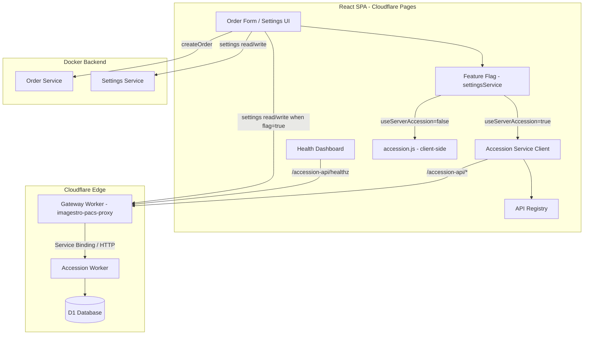
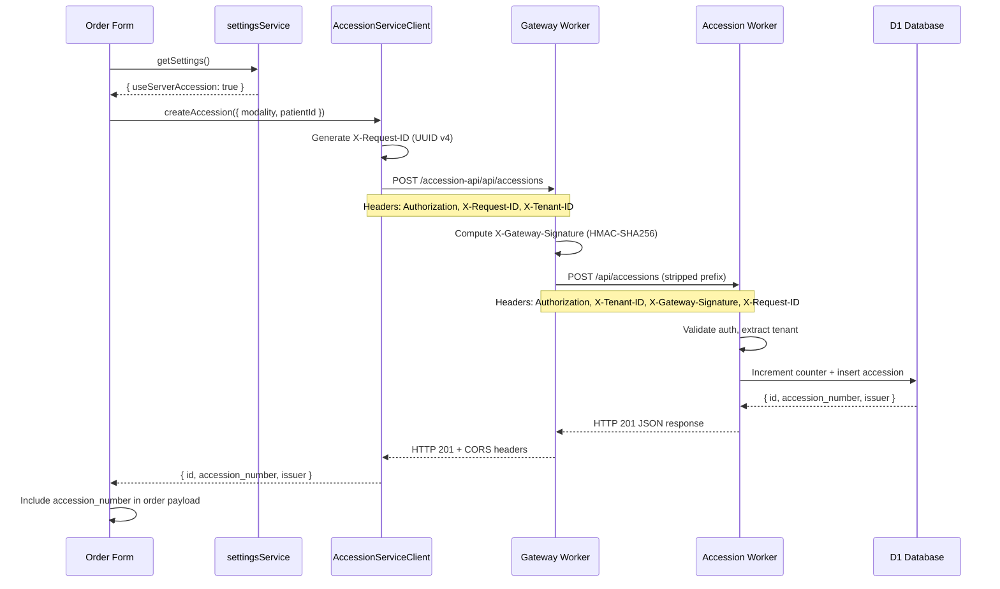
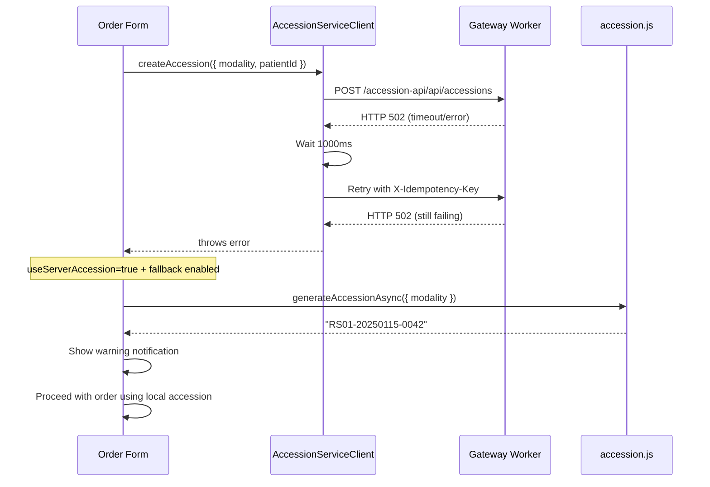
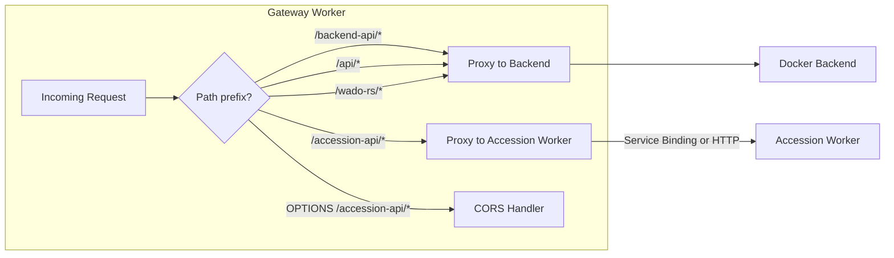

# Design Document: Accession Worker Integration

## Overview

This design describes the integration of the standalone accession-worker (Cloudflare Worker + D1) into the Imagestro PACS frontend platform. The integration connects the existing React/Vite SPA to the accession-worker through the API gateway, replacing unreliable client-side accession number generation (localStorage counters) with server-side generation that guarantees uniqueness across all devices and sessions.

### Key Design Decisions

1. **Gateway routing via path prefix** — Requests to `/accession-api/*` are forwarded by the gateway worker to the accession-worker with the prefix stripped. This avoids CORS issues and keeps the frontend same-origin. The gateway uses a Service Binding when available, falling back to HTTP fetch.
2. **`apiClient('accession')` pattern** — The new `Accession_Service_Client` uses the existing `apiClient` factory from `src/services/http.js`, inheriting timeout, auth header injection, and tenant context propagation. This ensures consistency with all other service modules.
3. **Feature flag with fallback** — The `useServerAccession` setting controls the generation mode. When server-side fails, the system falls back to client-side generation with a user-visible warning, ensuring workflow continuity.
4. **Pattern token conversion** — The accession-worker uses `{NNN...}` format for sequence tokens while the frontend UI uses `{SEQn}`. Bidirectional conversion happens at the settings service boundary.
5. **Retry with idempotency** — POST requests include an `X-Idempotency-Key` header to prevent duplicate accession creation on retry. GET requests retry once after 1 second on 5xx/timeout.
6. **HMAC gateway signature** — The gateway computes `HMAC-SHA256(X-Tenant-ID + X-Request-ID, GATEWAY_SHARED_SECRET)` and sends it as `X-Gateway-Signature`. The accession-worker trusts `X-Tenant-ID` from Service Bindings without verification.
7. **Health monitoring via API registry** — The accession-worker is registered in the API registry with a `/accession-api/healthz` health path, integrating into the existing health dashboard polling mechanism.

### Scope

- Gateway worker modifications to route `/accession-api/*` to the accession-worker
- New frontend service module (`src/services/accessionServiceClient.js`)
- API registry entry for the `accession` module
- Feature flag integration with `settingsService`
- Order creation flow modifications for server-side accession generation
- Settings page modifications for accession configuration sync
- Health dashboard integration
- Authentication/signature propagation through the gateway

## Architecture

### System Context Diagram



### Request Flow: Server-Side Accession Generation



### Request Flow: Fallback on Failure



### Gateway Routing Architecture



## Components and Interfaces

### New/Modified Files

```
src/services/
├── accessionServiceClient.js    # NEW: Server-side accession API client
├── api-registry.js              # MODIFIED: Add 'accession' module entry
├── accession.js                 # UNCHANGED: Retained for backward compatibility
├── settingsService.js           # MODIFIED: Route accession config to worker when flag=true
├── orderService.js              # UNCHANGED: Signature preserved
└── health.js                    # UNCHANGED: Uses API registry for polling

cloudflare/
├── worker.js                    # MODIFIED: Add /accession-api/* routing
└── accession-worker/            # UNCHANGED: Already deployed standalone
    └── src/index.ts
```

### AccessionServiceClient Interface

```javascript
// src/services/accessionServiceClient.js

/**
 * Creates a single accession number via the accession-worker.
 * @param {{ modality: string, patientId: string, orderId?: string }} params
 * @returns {Promise<{ id: string, accession_number: string, issuer: string }>}
 * @throws {{ status: number, message: string, requestId: string|null }}
 */
export async function createAccession({ modality, patientId, orderId });

/**
 * Creates multiple accession numbers in a single batch request.
 * @param {{ procedures: Array<{ modality: string, procedure_code: string, procedure_name: string }>, patient_national_id: string, patient_name: string }} params
 * @returns {Promise<{ accessions: Array<{ id: string, accession_number: string, issuer: string, modality: string, procedure_code: string }> }>}
 */
export async function createAccessionBatch(params);

/**
 * Lists accession records with cursor-based pagination.
 * @param {{ limit?: number, cursor?: string, source?: string, modality?: string, patient_national_id?: string, from_date?: string, to_date?: string }} filters
 * @returns {Promise<{ items: Array, next_cursor: string|null, has_more: boolean }>}
 */
export async function getAccessions(filters);

/**
 * Retrieves a single accession by its accession number.
 * @param {string} accessionNumber
 * @returns {Promise<Object>}
 */
export async function getAccessionByNumber(accessionNumber);
```

### Gateway Worker Modifications

```javascript
// cloudflare/worker.js — additions

const ACCESSION_WORKER_URL = 'https://accession-worker.<account>.workers.dev';

// Add to PROXY_PATHS
const PROXY_PATHS = ['/backend-api/', '/api/', '/wado-rs/', '/accession-api/'];

// New routing logic in fetch handler:
if (url.pathname.startsWith('/accession-api/')) {
  if (request.method === 'OPTIONS') return handlePreflight(request);
  return proxyToAccessionWorker(request, env, url);
}

async function proxyToAccessionWorker(request, env, url) {
  // Strip /accession-api prefix
  const targetPath = url.pathname.replace('/accession-api', '') + url.search;
  
  // Build headers: Authorization, Content-Type, X-Request-ID, X-Tenant-ID
  const headers = new Headers();
  const forwardHeaders = ['authorization', 'content-type', 'x-request-id'];
  forwardHeaders.forEach(h => {
    const v = request.headers.get(h);
    if (v) headers.set(h, v);
  });
  
  // Propagate tenant ID
  const tenantId = request.headers.get('x-tenant-id') || '';
  headers.set('X-Tenant-ID', tenantId);
  
  // Compute HMAC signature
  const requestId = request.headers.get('x-request-id') || '';
  const signature = await computeHMAC(tenantId + requestId, env.GATEWAY_SHARED_SECRET);
  headers.set('X-Gateway-Signature', signature);
  
  // Forward request body for non-GET methods
  const body = ['POST', 'PUT', 'PATCH', 'DELETE'].includes(request.method)
    ? request.body : null;
  
  try {
    // Prefer Service Binding if available
    const target = env.ACCESSION_WORKER || ACCESSION_WORKER_URL;
    const response = await fetch(typeof target === 'object'
      ? new Request(`https://accession-worker${targetPath}`, { method: request.method, headers, body })
      : `${target}${targetPath}`, { method: request.method, headers, body });
    
    // Forward response with CORS
    const responseHeaders = new Headers();
    responseHeaders.set('Content-Type', response.headers.get('content-type') || 'application/json');
    responseHeaders.set('Access-Control-Allow-Origin', url.origin);
    responseHeaders.set('Access-Control-Allow-Credentials', 'true');
    
    return new Response(response.body, {
      status: response.status,
      headers: responseHeaders
    });
  } catch (error) {
    return new Response(JSON.stringify({
      error: 'Bad Gateway',
      path: url.pathname,
      message: error.message
    }), {
      status: 502,
      headers: {
        'Content-Type': 'application/json',
        'Access-Control-Allow-Origin': url.origin,
        'Access-Control-Allow-Credentials': 'true'
      }
    });
  }
}
```

### API Registry Entry

```javascript
// Addition to DEFAULT_REGISTRY in src/services/api-registry.js
accession: { enabled: true, baseUrl: "/accession-api", healthPath: "/healthz", timeoutMs: 5000 },
```

### Feature Flag Integration

```javascript
// Pattern used in order creation flow:
import { getSettings } from './settingsService';
import { createAccession } from './accessionServiceClient';
import { generateAccessionAsync } from './accession';

async function getAccessionNumber({ modality, patientId }) {
  const settings = await getSettings();
  
  if (settings.useServerAccession) {
    try {
      const result = await createAccession({ modality, patientId });
      return result.accession_number;
    } catch (err) {
      // Fallback to client-side
      console.warn('[accession] Server generation failed, falling back to client-side:', err.message);
      notify('Accession generated locally due to server error');
      return generateAccessionAsync({ modality });
    }
  }
  
  return generateAccessionAsync({ modality });
}
```

### Settings Pattern Conversion

```javascript
// Convert worker format {NNNN} to UI format {SEQ4}
function workerPatternToUI(pattern) {
  return pattern.replace(/\{(N+)\}/g, (_, ns) => `{SEQ${ns.length}}`);
}

// Convert UI format {SEQ4} to worker format {NNNN}
function uiPatternToWorker(pattern) {
  return pattern.replace(/\{SEQ(\d+)\}/gi, (_, n) => '{' + 'N'.repeat(parseInt(n)) + '}');
}
```

## Data Models

### AccessionServiceClient Request/Response Types

```typescript
// Request: POST /accession-api/api/accessions
interface CreateAccessionRequest {
  modality: string;           // e.g., "CT", "MR"
  patient: {
    id: string;               // patient_national_id
  };
}

// Response: POST /accession-api/api/accessions
interface CreateAccessionResponse {
  id: string;                 // UUID v7
  accession_number: string;   // e.g., "RS01-20250115-0042"
  issuer: string;             // facility identifier
}

// Request: POST /accession-api/api/accessions/batch
interface BatchAccessionRequest {
  patient_national_id: string;
  patient_name: string;
  procedures: Array<{
    modality: string;
    procedure_code: string;
    procedure_name: string;
  }>;
}

// Response: POST /accession-api/api/accessions/batch
interface BatchAccessionResponse {
  accessions: Array<{
    id: string;
    accession_number: string;
    issuer: string;
    modality: string;
    procedure_code: string;
  }>;
}

// Response: GET /accession-api/api/accessions
interface ListAccessionsResponse {
  items: AccessionRecord[];
  next_cursor: string | null;
  has_more: boolean;
}

// Error response shape
interface AccessionErrorResponse {
  request_id?: string;
  error: string;
  code?: string;
}

// Client-side error thrown by AccessionServiceClient
interface AccessionClientError {
  status: number;
  message: string;
  requestId: string | null;
  originalError?: string;
}
```

### Gateway Worker Environment Additions

```typescript
// Additions to gateway worker env (wrangler.toml)
interface GatewayEnv {
  ACCESSION_WORKER?: Fetcher;       // Service Binding (preferred)
  GATEWAY_SHARED_SECRET: string;    // For HMAC computation
}
```

### Settings Data Flow

```typescript
// Settings stored in accession-worker (tenant_settings table)
interface AccessionWorkerConfig {
  pattern: string;                    // e.g., "{ORG}-{YYYY}{MM}{DD}-{NNNN}"
  counter_reset_policy: 'DAILY' | 'MONTHLY' | 'NEVER';
  sequence_digits: number;
  orgCode: string;
  siteCode: string;
  useModalityInSeqScope: boolean;
  starting_sequence?: number;         // For migration from client-side
}

// Settings displayed in frontend UI
interface AccessionUIConfig {
  pattern: string;                    // e.g., "{ORG}-{YYYY}{MM}{DD}-{SEQ4}"
  resetPolicy: 'daily' | 'monthly' | 'never';
  seqPadding: number;
  orgCode: string;
  siteCode: string;
  useModalityInSeqScope: boolean;
}
```


## Correctness Properties

*A property is a characteristic or behavior that should hold true across all valid executions of a system — essentially, a formal statement about what the system should do. Properties serve as the bridge between human-readable specifications and machine-verifiable correctness guarantees.*

### Property 1: Gateway path prefix stripping preserves remainder

*For any* request path starting with `/accession-api/` followed by an arbitrary suffix (including query strings), the gateway SHALL forward the request to the accession-worker with only the `/accession-api` prefix removed, preserving the remaining path segments, query parameters, and HTTP method unchanged.

**Validates: Requirements 1.1**

### Property 2: Gateway header forwarding is selective and complete

*For any* incoming request to `/accession-api/*` containing an arbitrary set of HTTP headers, the gateway SHALL forward exactly the Authorization, Content-Type, and X-Request-ID headers (when present) to the accession-worker, and SHALL forward the request body unchanged for POST, PUT, PATCH, and DELETE methods.

**Validates: Requirements 1.2**

### Property 3: Gateway response forwarding appends CORS

*For any* response received from the accession-worker with any status code and body, the gateway SHALL forward the status code and body unchanged while appending `Access-Control-Allow-Origin` (set to request origin) and `Access-Control-Allow-Credentials: true` headers.

**Validates: Requirements 1.3**

### Property 4: CreateAccession request body mapping

*For any* valid modality string and patientId string, calling `createAccession({ modality, patientId })` SHALL produce a POST request body where `patient.id` equals the provided patientId and the top-level `modality` field equals the provided modality.

**Validates: Requirements 2.1**

### Property 5: CreateAccessionBatch request body structure

*For any* array of procedure objects (each with modality, procedure_code, procedure_name) and shared patient data (patient_national_id, patient_name), calling `createAccessionBatch()` SHALL produce a POST request body with a `procedures` array matching the input items and the shared patient fields at the top level.

**Validates: Requirements 2.2**

### Property 6: GetAccessions filter-to-query-parameter mapping

*For any* filter object containing a subset of keys (limit, cursor, source, modality, patient_national_id, from_date, to_date) with arbitrary valid values, calling `getAccessions(filters)` SHALL produce a GET request with query parameters that exactly match the provided filter keys and values.

**Validates: Requirements 2.3**

### Property 7: GetAccessionByNumber URL construction

*For any* non-empty accession number string, calling `getAccessionByNumber(accessionNumber)` SHALL produce a GET request to the path `/api/accessions/{accessionNumber}` where the accession number is correctly URL-encoded in the path segment.

**Validates: Requirements 2.4**

### Property 8: Error response transformation

*For any* HTTP error response with a status code (4xx or 5xx), a body containing an `error` field and optionally a `request_id` field, the AccessionServiceClient SHALL throw an error object containing `status` (matching the HTTP status code), `message` (from the response body), and `requestId` (from the response body's `request_id` or null).

**Validates: Requirements 2.6**

### Property 9: X-Request-ID UUID v4 on every request

*For any* request made by the AccessionServiceClient (GET, POST, PUT, DELETE), the outgoing request SHALL include an `X-Request-ID` header whose value is a valid UUID v4 string (matching the pattern `[0-9a-f]{8}-[0-9a-f]{4}-4[0-9a-f]{3}-[89ab][0-9a-f]{3}-[0-9a-f]{12}`).

**Validates: Requirements 2.8, 10.5**

### Property 10: Settings pattern token round-trip

*For any* accession pattern string containing `{SEQn}` tokens (where n is 1-8), converting to worker format (`{NNN...}`) and back to UI format SHALL produce the original pattern string unchanged.

**Validates: Requirements 5.4, 5.5**

### Property 11: Batch response matching by procedure_code and modality

*For any* batch response containing N accession objects each with `procedure_code` and `modality` fields, and a corresponding request with N procedure items, the matching logic SHALL pair each response accession to exactly one request procedure where both `procedure_code` and `modality` match.

**Validates: Requirements 4.6**

### Property 12: Gateway HMAC signature computation

*For any* X-Tenant-ID string and X-Request-ID string, the gateway SHALL compute the X-Gateway-Signature as HMAC-SHA256 over the concatenation of the two strings using GATEWAY_SHARED_SECRET as the key, producing a consistent hex-encoded result.

**Validates: Requirements 8.1**

### Property 13: Idempotency key preservation on POST retry

*For any* POST request that receives a 5xx response or timeout, the retry attempt SHALL include an `X-Idempotency-Key` header with the same value as the original request (or a newly generated UUID if the original had none), ensuring the accession-worker can deduplicate the retry.

**Validates: Requirements 10.2**

### Property 14: Structured error on retry exhaustion

*For any* request that fails on both the initial attempt and the retry, the AccessionServiceClient SHALL reject with an error object containing all four required fields: `statusCode` (number), `message` (non-empty string), `requestId` (string), and `originalError` (string describing the underlying failure).

**Validates: Requirements 10.3**

### Property 15: Rate limit handling respects Retry-After bounds

*For any* HTTP 429 response, IF the `Retry-After` header contains a valid integer value ≤ 60, the client SHALL wait that many seconds before retrying once. IF the header is missing, malformed, or specifies a value > 60, the client SHALL reject immediately without waiting.

**Validates: Requirements 10.6**

### Property 16: Feature flag return type consistency

*For any* accession generation call regardless of whether `useServerAccession` is true or false, and regardless of whether the server call succeeds or falls back to client-side, the returned value SHALL always be a string (matching the return type of `generateAccessionAsync`).

**Validates: Requirements 3.7**

## Error Handling

### Error Categories and Responses

| Scenario | HTTP Status | Client Behavior | User Impact |
|----------|-------------|-----------------|-------------|
| Accession worker unreachable | 502 | Retry once, then fallback to client-side (if feature flag allows) | Warning notification |
| Authentication failure | 401/403 | No retry, propagate error | Error notification, redirect to login |
| Rate limited | 429 | Wait Retry-After (≤60s) then retry once | Brief delay, transparent |
| Validation error | 400/422 | No retry, show error | Error notification with details |
| Server error | 500 | Retry once after 1s | Fallback or error notification |
| Network timeout | - | Retry once after 1s | Fallback or error notification |
| Module disabled | - | Reject immediately (no HTTP) | Error notification |

### Retry Strategy

```
Initial Request
  ├── Success (2xx) → Return result
  ├── 4xx (except 429) → Throw immediately (no retry)
  ├── 429 with Retry-After ≤ 60s → Wait → Retry once
  │     ├── Success → Return result
  │     └── Failure → Throw structured error
  ├── 429 without valid Retry-After → Throw immediately
  ├── 5xx or timeout → Wait 1000ms → Retry once
  │     ├── Success → Return result
  │     └── Failure → Throw structured error
  └── Network error → Wait 1000ms → Retry once
        ├── Success → Return result
        └── Failure → Throw structured error
```

### Fallback Behavior (Order Creation)

When `useServerAccession` is `true` and server-side generation fails:
1. The AccessionServiceClient throws after retry exhaustion
2. The order creation flow catches the error
3. Falls back to `generateAccessionAsync({ modality })` for client-side generation
4. Displays a non-blocking warning: "Accession generated locally due to server unavailability"
5. Proceeds with order submission using the locally generated number

When `useServerAccession` is `true` and the requirement is strict (no fallback):
1. The AccessionServiceClient throws after retry exhaustion
2. The order creation flow catches the error
3. Displays an error notification with the failure reason
4. Preserves form data so the user can retry
5. Does NOT submit the order

### Health Degradation

- After 3 consecutive health check failures (at 30-second intervals = 90 seconds of downtime), the Health Dashboard displays a "degraded service" warning for the accession-worker
- The warning persists until a successful health check restores the status
- Health check failures do NOT affect the feature flag behavior — the fallback mechanism handles individual request failures independently

## Testing Strategy

### Unit Tests (Example-Based)

Unit tests cover specific scenarios, edge cases, and integration points:

- **Feature flag branching**: Verify correct code path for `useServerAccession` true/false/absent
- **Fallback behavior**: Verify client-side fallback on server failure with warning notification
- **Order creation integration**: Verify accession number is obtained before order submission
- **Settings routing**: Verify settings read/write routes to correct endpoint based on flag
- **Health dashboard**: Verify status mapping (200=healthy, non-200/timeout=unhealthy)
- **Module disabled**: Verify immediate rejection when accession module is disabled
- **Auth error propagation**: Verify 401/403 are not retried
- **Backward compatibility**: Verify all existing accession.js exports remain callable

### Property-Based Tests

Property-based tests verify universal properties across generated inputs using `fast-check`:

- **Minimum 100 iterations** per property test
- **Tag format**: `Feature: accession-worker-integration, Property {N}: {title}`
- Each property test maps to one correctness property from the design document

**Library**: `fast-check` (already used in the accession-worker test suite)

**Properties to implement**:
1. Gateway path prefix stripping (Property 1)
2. Gateway header forwarding (Property 2)
3. Gateway CORS appending (Property 3)
4. CreateAccession body mapping (Property 4)
5. CreateAccessionBatch body structure (Property 5)
6. Filter-to-query mapping (Property 6)
7. URL construction for getByNumber (Property 7)
8. Error response transformation (Property 8)
9. X-Request-ID UUID v4 format (Property 9)
10. Settings pattern token round-trip (Property 10)
11. Batch response matching (Property 11)
12. HMAC signature computation (Property 12)
13. Idempotency key on retry (Property 13)
14. Structured error on exhaustion (Property 14)
15. Rate limit Retry-After handling (Property 15)
16. Return type consistency (Property 16)

### Integration Tests

Integration tests verify end-to-end flows with mocked backend:

- **Gateway routing**: Verify requests flow from frontend through gateway to accession-worker
- **Full order creation flow**: Verify accession generation → order submission pipeline
- **Settings sync**: Verify settings read/write through gateway to accession-worker
- **Health polling**: Verify health dashboard correctly polls and displays status
- **Auth propagation**: Verify JWT and tenant headers reach the accession-worker

### Test File Structure

```
src/services/__tests__/
├── accessionServiceClient.test.js          # Unit tests for the service client
├── accessionServiceClient.property.test.js # Property-based tests (Properties 4-11, 13-16)
├── accessionIntegration.test.js            # Feature flag, order flow, settings integration
└── gatewayRouting.property.test.js         # Property-based tests (Properties 1-3, 12)
```
