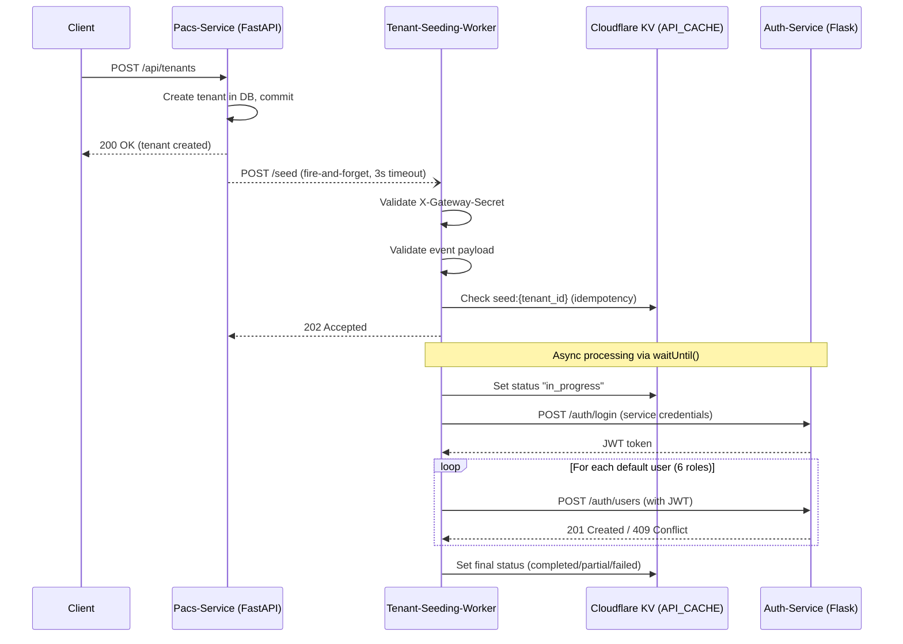
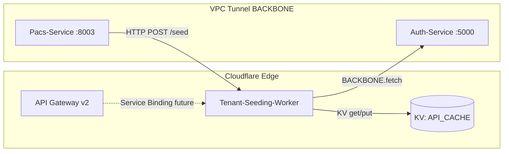

# Design Document: Tenant User Seeding

## Overview

This design describes an event-driven system that automatically creates default users when a new tenant is provisioned. The system consists of two main changes:

1. **Pacs-Service Enhancement**: After a tenant is created and committed to the database, the pacs-service emits a fire-and-forget HTTP webhook to the seeding worker.
2. **Tenant-Seeding-Worker (Cloudflare Worker)**: A new Hono/TypeScript worker that receives tenant creation events, authenticates with the auth-service via VPC tunnel, and creates a predefined set of default users for the new tenant.

The design follows the existing accession-worker pattern (Hono framework, typed Env, wrangler.jsonc, observability) but is simpler — no D1, Durable Objects, or rate limiting needed.

### Key Design Decisions

- **Fire-and-forget webhook** over queues: Simplicity wins here. The pacs-service fires the event and doesn't wait. If delivery fails, the manual trigger endpoint provides recovery.
- **KV-based idempotency** over database state: Cloudflare KV (API_CACHE) is already available and provides TTL-based expiry. No new infrastructure needed.
- **Service credentials login** over pre-shared JWT: The worker authenticates like any other client via `POST /auth/login`, getting a real JWT. This avoids long-lived tokens and leverages existing auth infrastructure.
- **Sequential user creation** over parallel: Simpler error handling, clearer retry semantics, and avoids overwhelming the auth-service. Six users is a small batch.
- **Constant-time secret comparison** for gateway auth: Uses `X-Gateway-Secret` header with timing-safe comparison, matching the simpler pattern specified in requirements (vs HMAC-SHA256 used by accession-worker).

## Architecture



### Component Topology



## Components and Interfaces

### 1. Pacs-Service Webhook Emitter

**Location**: `fullstack-orthanc-dicom/pacs-service/app/api/tenants.py`

**Changes**: Add webhook emission after `db.commit()` in `create_tenant()`.

```python
# After db.commit() and db.refresh(db_tenant)
import httpx
import uuid
from datetime import datetime, timezone

async def emit_tenant_created_event(tenant: Tenant):
    """Fire-and-forget webhook to tenant-seeding-worker."""
    webhook_url = os.getenv("TENANT_SEED_WEBHOOK_URL")
    gateway_secret = os.getenv("GATEWAY_SHARED_SECRET")
    
    if not webhook_url:
        return  # Seeding not configured
    
    event = {
        "event_id": str(uuid.uuid4()),
        "tenant_id": str(tenant.id),
        "tenant_code": tenant.code,
        "tenant_name": tenant.name,
        "tenant_email": tenant.email or "",
        "created_at": datetime.now(timezone.utc).isoformat()
    }
    
    headers = {
        "Content-Type": "application/json",
        "X-Gateway-Secret": gateway_secret or ""
    }
    
    try:
        async with httpx.AsyncClient(timeout=3.0) as client:
            response = await client.post(webhook_url, json=event, headers=headers)
            if response.status_code != 202:
                logger.warning(f"Seed webhook non-202: tenant={tenant.id}, status={response.status_code}")
    except Exception as e:
        logger.warning(f"Seed webhook failed: tenant={tenant.id}, error={str(e)}")
```

### 2. Tenant-Seeding-Worker

**Location**: `cloudflare/tenant-seeding-worker/`

**Framework**: Hono with TypeScript, following accession-worker conventions.

#### Environment Interface

```typescript
export interface Env {
  // VPC Tunnel to reach auth-service
  BACKBONE: Fetcher;
  
  // KV for idempotency and status tracking
  API_CACHE: KVNamespace;
  
  // Secrets (wrangler secret put)
  GATEWAY_SHARED_SECRET: string;
  SEED_SERVICE_USERNAME: string;
  SEED_SERVICE_PASSWORD: string;
  JWT_SECRET: string;
  
  // Environment variables
  AUTH_SERVICE_URL: string;  // "http://auth-service:5000"
}
```

#### Endpoints

| Method | Path | Auth | Description |
|--------|------|------|-------------|
| `POST` | `/seed` | `X-Gateway-Secret` | Receive tenant creation events |
| `POST` | `/seed/manual` | JWT (SUPERADMIN) | Manual trigger for existing tenants |
| `GET` | `/seed/status/:tenant_id` | None | Query seeding status |
| `GET` | `/health` | None | Health check |

#### Middleware Chain (simplified vs accession-worker)

1. Request ID (generate/propagate)
2. Logger (structured JSON)
3. Security headers
4. Route-level auth (no global auth needed)

### 3. Auth-Service Integration

The worker interacts with auth-service via two endpoints through the BACKBONE VPC tunnel:

**Login** (`POST /auth/login`):
- Request: `{ "username": "<SEED_SERVICE_USERNAME>", "password": "<SEED_SERVICE_PASSWORD>" }`
- Response: `{ "status": "success", "access_token": "...", "expires_in": 86400 }`

**Create User** (`POST /auth/users`):
- Headers: `Authorization: Bearer <token>`
- Request: `{ "username": "...", "email": "...", "password": "...", "full_name": "...", "role": "...", "is_active": true, "tenant_id": "..." }`
- Response 201: User created
- Response 409: Duplicate (treated as success)

### 4. Wrangler Configuration

```jsonc
{
  "name": "tenant-seeding-worker",
  "main": "src/index.ts",
  "compatibility_date": "2025-01-15",
  "compatibility_flags": ["nodejs_compat"],
  
  "kv_namespaces": [
    {
      "binding": "API_CACHE",
      "id": "19df22b7c1764cb7b091e2ed929df9b4"
    }
  ],
  
  "vpc_networks": [
    {
      "binding": "BACKBONE",
      "tunnel_id": "5c496701-6046-410a-a870-f20f096c65e4",
      "remote": true
    }
  ],
  
  "vars": {
    "AUTH_SERVICE_URL": "http://auth-service:5000"
  },
  
  "observability": {
    "enabled": true,
    "head_sampling_rate": 1,
    "logs": {
      "enabled": true,
      "head_sampling_rate": 1,
      "persist": true,
      "invocation_logs": true
    }
  }
}
```

## Data Models

### TenantCreatedEvent

```typescript
interface TenantCreatedEvent {
  event_id: string;      // UUID v4
  tenant_id: string;     // UUID, non-empty
  tenant_code: string;   // Non-empty, used for username/email generation
  tenant_name: string;   // Non-empty, max 255 chars
  tenant_email: string;  // Valid email format
  created_at: string;    // ISO 8601 UTC timestamp
}
```

### SeedingStatus (stored in KV as JSON)

```typescript
interface SeedingStatus {
  tenant_id: string;
  event_id: string;
  status: 'pending' | 'in_progress' | 'completed' | 'partial' | 'failed';
  users_created: number;
  users_failed: number;
  error_details: ErrorEntry[];  // Max 50 entries
  started_at: string;           // ISO 8601
  completed_at: string | null;  // ISO 8601, null while in_progress
}

interface ErrorEntry {
  username: string;
  role: string;
  error: string;       // Max 500 chars
  timestamp: string;
}
```

### DefaultUserDefinition

```typescript
interface DefaultUserDefinition {
  usernamePrefix: string;
  emailPrefix: string;
  role: string;
  fullNamePrefix: string;
}

const DEFAULT_USERS: DefaultUserDefinition[] = [
  { usernamePrefix: 'admin',     emailPrefix: 'admin',     role: 'TENANT_ADMIN', fullNamePrefix: 'Admin' },
  { usernamePrefix: 'dokter',    emailPrefix: 'dokter',    role: 'DOCTOR',       fullNamePrefix: 'Dokter' },
  { usernamePrefix: 'radiolog',  emailPrefix: 'radiolog',  role: 'RADIOLOGIST',  fullNamePrefix: 'Radiolog' },
  { usernamePrefix: 'teknisi',   emailPrefix: 'teknisi',   role: 'TECHNICIAN',   fullNamePrefix: 'Teknisi' },
  { usernamePrefix: 'clerk',     emailPrefix: 'clerk',     role: 'CLERK',        fullNamePrefix: 'Clerk' },
  { usernamePrefix: 'perawat',   emailPrefix: 'perawat',   role: 'NURSE',        fullNamePrefix: 'Perawat' },
];
```

### Password Generation

```typescript
function generatePassword(): string {
  // 16 chars: 4 uppercase + 4 lowercase + 4 digits + 4 special, shuffled
  const upper = 'ABCDEFGHIJKLMNOPQRSTUVWXYZ';
  const lower = 'abcdefghijklmnopqrstuvwxyz';
  const digits = '0123456789';
  const special = '!@#$%^&*';
  
  // Ensure at least one of each category, fill remaining randomly
  // Use crypto.getRandomValues() for secure randomness
}
```

### Retry Configuration

```typescript
interface RetryConfig {
  maxRetries: number;
  baseDelayMs: number;
  // Actual delay = baseDelayMs * 2^attempt
}

const USER_CREATION_RETRY: RetryConfig = { maxRetries: 3, baseDelayMs: 1000 };
const AUTH_LOGIN_RETRY: RetryConfig = { maxRetries: 3, baseDelayMs: 5000 };
```


## Correctness Properties

*A property is a characteristic or behavior that should hold true across all valid executions of a system — essentially, a formal statement about what the system should do. Properties serve as the bridge between human-readable specifications and machine-verifiable correctness guarantees.*

### Property 1: Event payload correctness

*For any* valid tenant (with id, code, name, email), the emitted Tenant_Created_Event SHALL contain all required fields (tenant_id, tenant_code, tenant_name, tenant_email, event_id, created_at) where event_id is a valid UUID v4 and created_at is a valid ISO 8601 UTC timestamp.

**Validates: Requirements 1.1, 1.4, 7.2**

### Property 2: Event validation accepts valid and rejects invalid payloads

*For any* JSON payload, the validation function SHALL accept it if and only if it contains a non-empty tenant_id string, a non-empty tenant_code string, a non-empty tenant_name string (max 255 chars), and a non-empty tenant_email string in valid email format. All other payloads SHALL be rejected with a 400 response.

**Validates: Requirements 2.1, 2.2**

### Property 3: Idempotent event processing

*For any* valid Tenant_Created_Event processed successfully, processing the same event (same tenant_id) a second time SHALL NOT create additional users and SHALL return a 202 response without re-initiating the seeding process.

**Validates: Requirements 2.4**

### Property 4: User definition generation from tenant data

*For any* tenant_code and tenant_name, the generated user definitions SHALL produce exactly 6 users where each username follows the pattern `{prefix}.{lowercase(tenant_code)}`, each email follows `{prefix}@{lowercase(tenant_code)}.local`, each full_name follows `{Prefix} {tenant_name}`, each user has `is_active=true`, and each user has the correct `tenant_id` from the event.

**Validates: Requirements 3.1, 3.3, 3.4, 3.6**

### Property 5: Password complexity

*For any* generated password, it SHALL have at least 12 characters and contain at least one uppercase letter, at least one lowercase letter, at least one digit, and at least one special character.

**Validates: Requirements 3.2**

### Property 6: Status determination from outcome counts

*For any* seeding operation with `users_created` and `users_failed` counts where `users_created + users_failed == total_users_attempted`: if `users_failed == 0` then status SHALL be "completed"; if `users_created > 0 AND users_failed > 0` then status SHALL be "partial"; if `users_created == 0` then status SHALL be "failed".

**Validates: Requirements 5.3, 6.4, 6.5, 6.6**

### Property 7: Retry classification by HTTP status code

*For any* HTTP response from the auth-service user creation endpoint: if status is 5xx, the request SHALL be retried up to 3 times with exponential backoff (1s, 2s, 4s); if status is 409, the user SHALL be treated as successfully created; if status is any other 4xx, the request SHALL NOT be retried and the user SHALL be marked as permanently failed.

**Validates: Requirements 5.1, 5.5, 5.6**

### Property 8: Gateway secret validation

*For any* incoming request to the `/seed` endpoint, if the `X-Gateway-Secret` header value matches the configured `GATEWAY_SHARED_SECRET` (constant-time comparison), the request SHALL be processed; otherwise, the request SHALL be rejected with a 401 response regardless of payload validity.

**Validates: Requirements 7.4, 7.5**

### Property 9: Manual trigger skips existing roles

*For any* tenant with an existing set of users covering a subset of the 6 default roles, the manual trigger SHALL create users only for roles not already present, and the count of created users SHALL equal `6 - count(existing_roles)`.

**Validates: Requirements 8.4**

### Property 10: Status record structure and limits

*For any* completed seeding operation, the stored SeedingStatus record SHALL contain all required fields (tenant_id, event_id, status, users_created, users_failed, error_details, started_at, completed_at), the error_details array SHALL have at most 50 entries, and each entry SHALL be at most 500 characters.

**Validates: Requirements 6.2**

## Error Handling

### Pacs-Service (Webhook Emission)

| Failure Mode | Behavior |
|---|---|
| Webhook URL not configured | Skip emission silently (no error) |
| Connection refused / DNS failure | Log WARNING with tenant_id, return tenant creation success |
| Timeout (>3s) | Log WARNING with tenant_id, return tenant creation success |
| Non-2xx response | Log WARNING with tenant_id and status code, return tenant creation success |

### Tenant-Seeding-Worker

| Failure Mode | HTTP Response | Behavior |
|---|---|---|
| Missing/invalid `X-Gateway-Secret` | 401 | No processing, no logging of payload |
| Invalid event payload | 400 | Log validation error, discard event |
| KV unavailable (idempotency check) | 500 | Allow sender to retry |
| Auth-service login failure (all 3 attempts) | N/A (async) | Abort seeding, set status "failed" |
| User creation 5xx / timeout | N/A (async) | Retry up to 3x with backoff (1s, 2s, 4s) |
| User creation 4xx (non-409) | N/A (async) | No retry, mark user as failed, continue |
| User creation 409 | N/A (async) | Treat as success, continue |
| Auth-service unreachable (VPC tunnel down) | N/A (async) | Retry entire operation 3x (5s, 10s, 20s), skip already-created users |
| JWT expired during operation | N/A (async) | Re-authenticate (up to 3x), retry failed request |

### Error Detail Truncation

Error details stored in KV are capped:
- Max 50 error entries per seeding operation
- Each error message truncated to 500 characters
- Prevents KV value size from growing unbounded

## Testing Strategy

### Property-Based Testing

**Library**: [fast-check](https://github.com/dubzzz/fast-check) (TypeScript)

Property-based tests will validate the 10 correctness properties defined above. Each test runs a minimum of 100 iterations with randomly generated inputs.

**Tag format**: `Feature: tenant-user-seeding, Property {N}: {title}`

Key generators needed:
- `arbTenantCode`: Alphanumeric strings (1-20 chars)
- `arbTenantName`: Unicode strings (1-255 chars)
- `arbEmail`: Valid email format strings
- `arbEventPayload`: Complete TenantCreatedEvent objects
- `arbInvalidPayload`: Payloads with various missing/invalid fields
- `arbHttpStatus`: Status codes in ranges (2xx, 4xx non-409, 409, 5xx)
- `arbExistingRoles`: Subsets of the 6 default roles

### Unit Tests (Example-Based)

| Area | Test Cases |
|---|---|
| Webhook emission | Timeout handling, connection error, non-2xx response |
| Event receipt | Valid event → 202, duplicate event → 202 (no-op) |
| Auth flow | Login success, login failure after 3 attempts, token refresh |
| User creation | All succeed, some fail, all fail, 409 handling |
| Manual trigger | Missing JWT → 403, non-SUPERADMIN → 403, non-existent tenant → 404 |
| Status endpoint | Existing status → JSON, missing status → 404 |
| KV failure | KV unavailable → 500 |

### Integration Tests

| Scenario | Components |
|---|---|
| End-to-end happy path | Pacs-service → Worker → Auth-service (mocked) |
| VPC tunnel connectivity | Worker → BACKBONE → Auth-service health check |
| KV read/write | Worker → API_CACHE namespace |

### Test File Structure

```
cloudflare/tenant-seeding-worker/
├── src/
│   ├── index.ts
│   ├── types.ts
│   ├── routes/
│   │   ├── seed.ts
│   │   ├── manual.ts
│   │   ├── status.ts
│   │   └── health.ts
│   ├── services/
│   │   ├── auth-client.ts
│   │   ├── user-seeder.ts
│   │   └── password-generator.ts
│   ├── middleware/
│   │   ├── request-id.ts
│   │   ├── gateway-auth.ts
│   │   └── jwt-auth.ts
│   └── utils/
│       ├── validation.ts
│       ├── retry.ts
│       └── status.ts
├── tests/
│   ├── properties/
│   │   ├── event-payload.property.test.ts
│   │   ├── validation.property.test.ts
│   │   ├── user-generation.property.test.ts
│   │   ├── password.property.test.ts
│   │   ├── status-determination.property.test.ts
│   │   ├── retry-classification.property.test.ts
│   │   ├── gateway-auth.property.test.ts
│   │   └── manual-trigger.property.test.ts
│   ├── unit/
│   │   ├── auth-client.test.ts
│   │   ├── user-seeder.test.ts
│   │   ├── routes.test.ts
│   │   └── idempotency.test.ts
│   └── integration/
│       └── e2e.test.ts
├── wrangler.jsonc
├── package.json
├── tsconfig.json
└── vitest.config.ts
```
