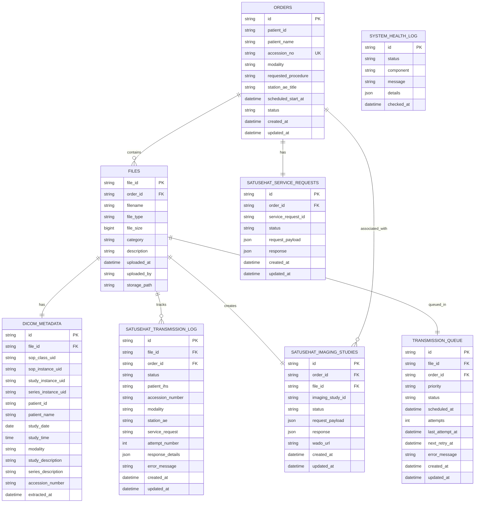
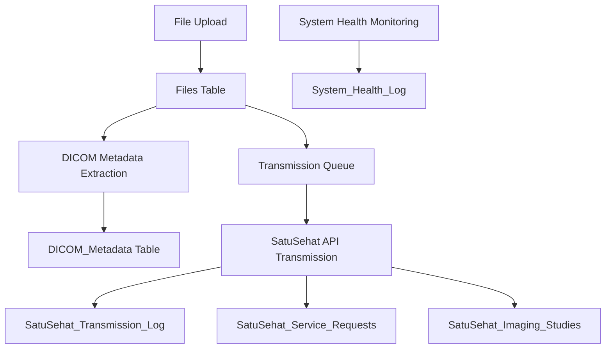

# SatuSehat DICOM Upload Monitoring Database Schema Diagram

## Entity Relationship Diagram

## Key Relationships Explained

### Orders and Files
- Each medical order can have multiple associated files (DICOM images, reports, etc.)
- The order contains critical information required for SatuSehat transmission:
  - Accession Number (unique identifier)
  - Patient information
  - Modality
  - Requested procedure
  - Station AE Title

### Files and Metadata
- Each DICOM file has associated metadata extracted from the DICOM headers
- This metadata is essential for creating proper SatuSehat resources

### Transmission Tracking
- Every transmission attempt is logged in the SatuSehat_Transmission_Log
- This enables monitoring of success/failure rates and error analysis
- Retry mechanisms are supported through the attempt tracking

### Queue Management
- Files are placed in a transmission queue for processing
- Priority levels allow for expedited processing of critical files
- Automatic retry scheduling is managed through the queue

### SatuSehat Resources
- Service requests are tracked separately as they are a prerequisite for ImagingStudies
- Each file results in an ImagingStudy resource in SatuSehat
- WADO URLs are stored for accessing transmitted DICOM files

## Data Flow Visualization

This schema provides a comprehensive foundation for monitoring DICOM uploads to SatuSehat, with full traceability and error handling capabilities.